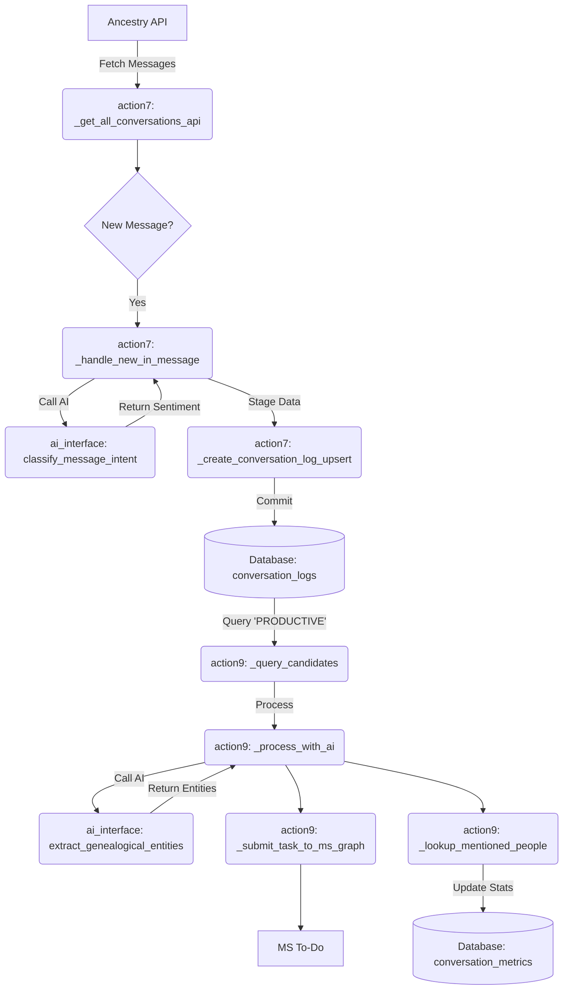
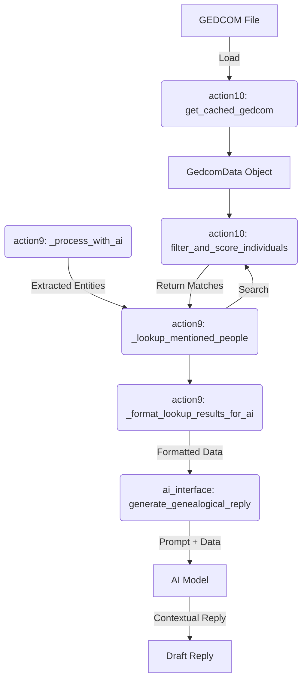

# Data Flow Map - Phase 1

## 1. Inbox -> Classification -> Extraction -> Database

This flow describes how incoming messages are fetched, classified by AI, and how productive conversations are processed to extract genealogical data.

### 1.1 Fetching Messages

* **File:** `actions/action7_inbox.py`
* **Function:** `InboxProcessor._get_all_conversations_api`
* **Process:**
  1. Calls Ancestry API endpoint `/app-api/express/v2/conversations`.
  2. Iterates through the response to extract conversation details using `_extract_conversation_info`.
  3. Checks for new messages by comparing timestamps with the database (`_process_in_message`).

### 1.2 Classification

* **File:** `actions/action7_inbox.py`
* **Function:** `InboxProcessor._handle_new_in_message`
* **Process:**
  1. Calls `InboundOrchestrator.process_message`.
  2. `InboundOrchestrator` calls `ai.ai_interface.classify_message_intent`.
  3. **AI Model:** Uses `ai_prompts.json` (key: `intent_classification`) to classify message as `PRODUCTIVE`, `DESIST`, `ENTHUSIASTIC`, etc.
  4. **Result:** The classification is returned as `ai_sentiment_result`.

### 1.3 Storage (Classification)

* **File:** `actions/action7_inbox.py` & `database.py`
* **Function:** `InboxProcessor._create_conversation_log_upsert` -> `commit_bulk_data`
* **Process:**
  1. `_create_conversation_log_upsert` creates a dictionary containing the `ai_sentiment_result`.
  2. This dictionary is staged in `ctx.conv_log_upserts_dicts`.
  3. `_final_commit` (or batch commit) calls `database.commit_bulk_data`.
  4. **Database:** The classification is saved to the `conversation_logs` table in the `sentiment` column.

### 1.4 Handoff to Action 9

* **File:** `actions/action9_process_productive.py`
* **Function:** `_query_candidates`
* **Process:**
  1. Queries the `conversation_logs` table joined with `people`.
  2. **Filter:** Selects messages where `sentiment` is `'PRODUCTIVE'` (and other criteria like not previously processed).
  3. Returns a list of `Person` objects associated with these productive conversations.

### 1.5 Extraction

* **File:** `actions/action9_process_productive.py`
* **Function:** `_process_with_ai`
* **Process:**
  1. Formats the conversation history.
  2. Calls `ai.ai_interface.extract_genealogical_entities`.
  3. **AI Model:** Uses `ai_prompts.json` (key: `extraction_task`) to extract names, dates, places, and relationships.
  4. **Result:** Returns `extracted_data` (dictionary) and `suggested_tasks` (list).

### 1.6 Final Storage (Extracted Data)

* **File:** `actions/action9_process_productive.py`
* **Function:** `_submit_task_to_ms_graph` & `_lookup_mentioned_people`
* **Process:**
  1. **Tasks:** `_submit_task_to_ms_graph` creates tasks in Microsoft To-Do based on `suggested_tasks`.
  2. **Analytics:** `_lookup_mentioned_people` attempts to find extracted people in GEDCOM or API.
     * Calls `_track_person_lookup_analytics`.
     * Updates `conversation_metrics` and `engagement_events` tables in the database.
  3. **Note:** Extracted genealogical data (names/dates) is **not** directly used to create new `Person` records or update `DnaMatch` records in this flow. It is primarily used for task generation and analytics.

---

## 2. GEDCOM -> Action 10 -> Context Generation

This flow describes how GEDCOM data is loaded, analyzed, and used to generate context-aware AI responses.

### 2.1 GEDCOM Loading

* **File:** `actions/action10.py`
* **Function:** `get_cached_gedcom`
* **Process:**
  1. Checks `_GedcomCacheState.cache`.
  2. If empty, calls `genealogy.gedcom.gedcom_utils.load_gedcom_data`.
  3. Parses the GEDCOM file defined in `config.database.gedcom_file_path`.
  4. Returns a `GedcomData` object.

### 2.2 Analysis

* **File:** `actions/action10.py` & `research/relationship_utils.py`
* **Function:** `filter_and_score_individuals` (via `action9` usage)
* **Process:**
  1. `action9` calls `_search_gedcom_for_person`.
  2. This calls `action10.filter_and_score_individuals`.
  3. **Logic:** Uses `research.relationship_utils` (e.g., `fast_bidirectional_bfs`) and `genealogy.universal_scoring` to find and score matches between extracted entities and GEDCOM individuals.

### 2.3 Context Generation

* **File:** `actions/action9_process_productive.py`
* **Function:** `_generate_contextual_reply_with_lookup`
* **Note:** This flow is now routed through `InboundOrchestrator._run_research_flow()` in `messaging/inbound.py` for integrated semantic search and draft generation.
* **Process:**
  1. **Gather Data:**
     * Calls `_get_person_context_data` to get DNA match info and tree statistics.
     * Calls `_lookup_mentioned_people` (using Action 10 logic) to find details about people mentioned in the chat.
  2. **Format:** Calls `_format_lookup_results_for_ai` to create a string representation of the findings (e.g., "Found John Doe in GEDCOM...").
  3. **Generate:** Calls `ai.ai_interface.generate_genealogical_reply`.
  4. **Prompt:** The `genealogical_data_str` (containing the formatted lookup results) is injected into the `genealogical_reply` prompt template.
  5. **AI Output:** The AI generates a response that references the specific family tree data found in the GEDCOM file.

