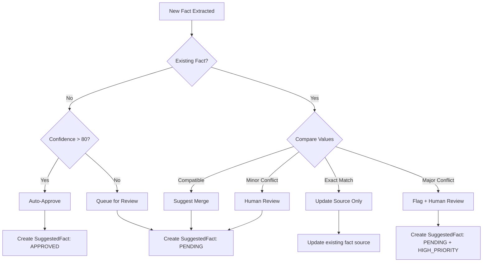
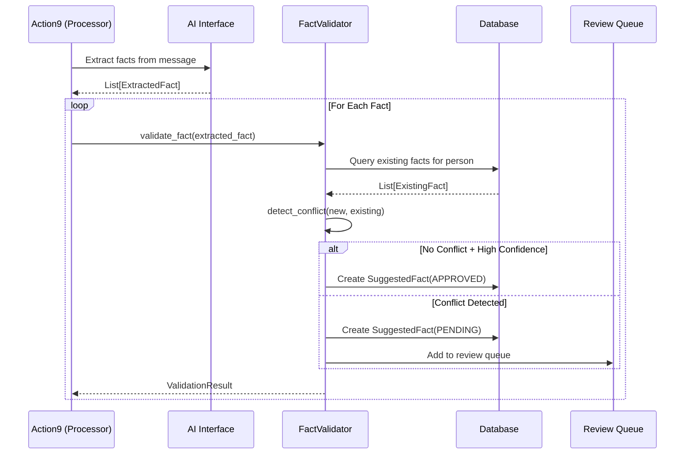
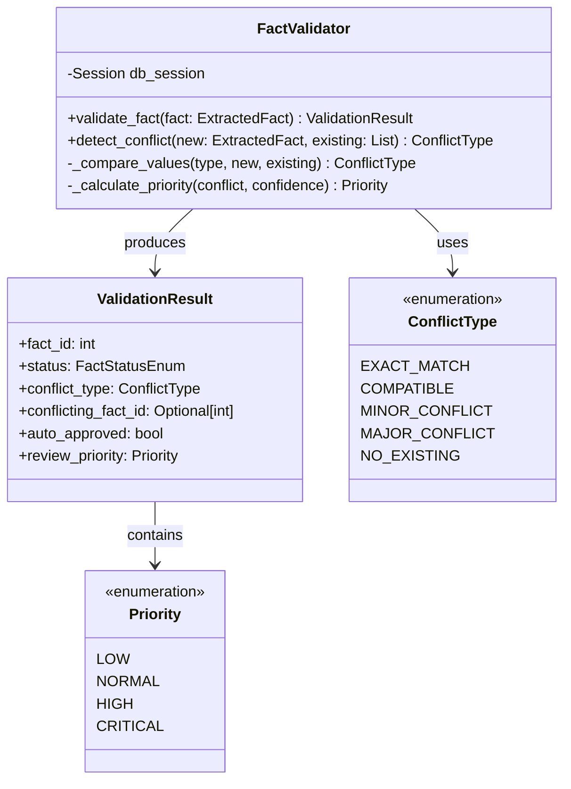

# Technical Specification: Data Validation Pipeline

## 1. Overview

The Data Validation Pipeline ensures that genealogical facts extracted from conversations are validated, conflict-checked, and safely integrated into the user's knowledge base. This system prevents data corruption and maintains data integrity by requiring human approval for conflicting or low-confidence facts.

**Primary Goal:** Transform raw extracted data into validated, structured facts with conflict detection and human-in-the-loop approval.

**Location:**
- Module: `genealogy/fact_validator.py`
- Existing Model: `SuggestedFact` (database.py)
- Integration Point: `InboundOrchestrator._validate_and_stage_facts()` in `messaging/inbound.py` (Note: originally spec'd against action9_process_productive.py, but actual integration is via InboundOrchestrator)

---

## 2. Fact Data Structure

### 2.1 Existing Schema (database.py)

The `SuggestedFact` model already provides the foundation:

| Column | Type | Purpose |
|--------|------|---------|
| `fact_type` | Enum | BIRTH, DEATH, RELATIONSHIP, MARRIAGE, LOCATION, OTHER |
| `original_value` | Text | Raw text from conversation |
| `new_value` | Text | AI-structured value |
| `confidence_score` | Integer | 0-100 AI confidence |
| `status` | Enum | PENDING, APPROVED, REJECTED |
| `source_message_id` | String | Traceability to source |

### 2.2 Extended Fact Structure (Runtime)

For conflict detection, we need a richer runtime representation:

```python
@dataclass
class ExtractedFact:
    """Runtime representation of a fact for validation."""
    fact_type: FactTypeEnum
    subject_person_id: int          # Who is this fact about?
    original_text: str              # "My grandmother Mary was born in 1920"
    structured_value: str           # "1920" or "Mary Ellen Smith"
    normalized_value: str           # "1920-01-01" (ISO date) or standardized name
    confidence: int                 # 0-100
    source_conversation_id: str     # Traceability
    extraction_timestamp: datetime

@dataclass
class ExistingFact:
    """Representation of a fact already in the tree/database."""
    fact_type: FactTypeEnum
    person_id: int
    value: str
    source: str                     # "GEDCOM", "User Input", "Conversation"
    last_updated: datetime
```

---

## 3. Conflict Detection Logic

### 3.1 Conflict Types

| Conflict Type | Description | Example | Resolution |
|---------------|-------------|---------|------------|
| **EXACT_MATCH** | New fact matches existing | Birth: 1920 vs 1920 | Auto-approve, update source |
| **COMPATIBLE** | New fact adds detail | Birth: 1920 vs 1920-03-15 | Suggest merge |
| **MINOR_CONFLICT** | Small discrepancy | Birth: 1920 vs 1921 | Human review |
| **MAJOR_CONFLICT** | Significant disagreement | Birth: 1920 vs 1850 | Human review + flag |
| **NO_EXISTING** | No prior value exists | Birth: (empty) vs 1920 | Auto-approve if confidence > 80 |

### 3.2 Detection Algorithm



### 3.3 Comparison Functions

```python
def compare_dates(existing: str, new: str) -> ConflictType:
    """
    Compare date values with tolerance.
    - Exact: "1920" == "1920"
    - Compatible: "1920" can be enhanced to "1920-03-15"
    - Minor: 1 year difference
    - Major: > 5 year difference
    """
    pass

def compare_names(existing: str, new: str) -> ConflictType:
    """
    Compare names using fuzzy matching.
    - Exact: "Mary Smith" == "Mary Smith"
    - Compatible: "Mary" can be enhanced to "Mary Ellen Smith"
    - Minor: Spelling variants (Mary/Marie)
    - Major: Completely different names
    """
    pass

def compare_locations(existing: str, new: str) -> ConflictType:
    """
    Compare locations with hierarchy awareness.
    - Exact: "Ohio, USA" == "Ohio, USA"
    - Compatible: "USA" can be refined to "Ohio, USA"
    - Minor: Adjacent locations
    - Major: Different countries/regions
    """
    pass
```

---

## 4. Validation Pipeline Flow

### 4.1 Sequence Diagram



### 4.2 Class Design



---

## 5. Review Queue Interface

### 5.1 CLI Commands

```bash
# List pending facts for review
python main.py review --list

# Review a specific fact
python main.py review --fact-id 123 --action approve
python main.py review --fact-id 123 --action reject --reason "Incorrect date"

# Bulk review by confidence
python main.py review --auto-approve --min-confidence 90
```

### 5.2 Review Data Display

```
┌──────────────────────────────────────────────────────────────────────┐
│ PENDING FACT #123                                    Priority: HIGH  │
├──────────────────────────────────────────────────────────────────────┤
│ Type: BIRTH                                                          │
│ Person: Mary Ellen Smith (ID: 456)                                   │
│ Source: Conversation with "Sarah Jenkins" on 2025-11-15              │
├──────────────────────────────────────────────────────────────────────┤
│ ORIGINAL TEXT:                                                       │
│ "My grandmother Mary was born around 1920 in Ohio"                   │
├──────────────────────────────────────────────────────────────────────┤
│ EXTRACTED VALUE: 1920                                                │
│ CONFIDENCE: 75%                                                      │
├──────────────────────────────────────────────────────────────────────┤
│ ⚠️  CONFLICT DETECTED                                                │
│ Existing Value: 1918 (Source: GEDCOM import)                         │
│ Conflict Type: MINOR (2-year difference)                             │
├──────────────────────────────────────────────────────────────────────┤
│ Actions: [A]pprove  [R]eject  [M]erge  [S]kip                        │
└──────────────────────────────────────────────────────────────────────┘
```

---

## 6. Integration Points

### 6.1 Action 9 Integration

In `action9_process_productive.py`, after AI extraction:

```python
from genealogy.fact_validator import FactValidator

def process_productive_message(session_manager, message, person):
    # Existing: Extract entities via AI
    extracted_facts = extract_genealogical_entities(message.content)

    # NEW: Validate each fact
    validator = FactValidator(session_manager.get_db_session())
    validation_results = []

    for fact in extracted_facts:
        result = validator.validate_fact(fact, person.id)
        validation_results.append(result)

        if result.conflict_type in [ConflictType.MINOR_CONFLICT, ConflictType.MAJOR_CONFLICT]:
            logger.warning(f"Conflict detected for {fact.fact_type}: {result.conflict_type}")

    # Log summary
    auto_approved = sum(1 for r in validation_results if r.auto_approved)
    pending = sum(1 for r in validation_results if r.status == FactStatusEnum.PENDING)
    logger.info(f"Validated {len(validation_results)} facts: {auto_approved} auto-approved, {pending} pending review")
```

### 6.2 Database Updates

The existing `SuggestedFact` model is sufficient. Add an index for review queue queries:

```python
# In database.py - Add to SuggestedFact.__table_args__
Index("ix_suggested_facts_status_confidence", "status", "confidence_score"),
```

---

## 7. Implementation Steps

> **Note:** These steps are now fully implemented.

1. **Create `genealogy/fact_validator.py`**: Implement `FactValidator` class with conflict detection.
2. **Add comparison functions**: Date, name, and location comparison with tolerance.
3. **Update `action9`**: Integrate validation after extraction.
4. **Add CLI commands**: Implement review queue interface in `main.py`.
5. **Add database index**: Optimize review queue queries.
6. **Write tests**: Conflict detection tests with edge cases.

---

## 8. Configuration

Add to `config/config_schema.py`:

```python
@dataclass
class ValidationSettings:
    auto_approve_threshold: int = 80  # Auto-approve facts with confidence >= 80
    date_tolerance_years: int = 1     # Minor conflict if within 1 year
    name_similarity_threshold: float = 0.85  # Fuzzy match threshold
    enable_auto_approve: bool = True  # Toggle auto-approval
```
