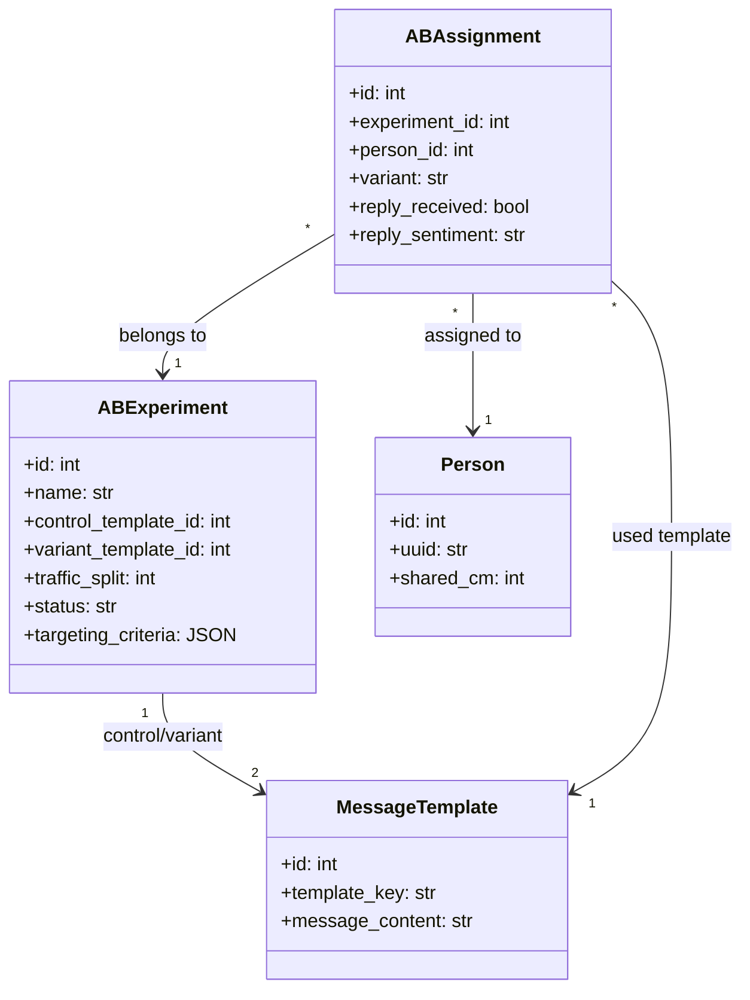
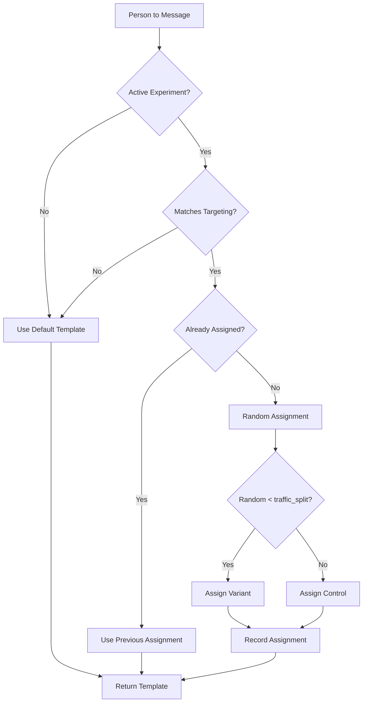

# Technical Specification: Engagement Optimization Framework

## 1. Overview

The Engagement Optimization Framework provides A/B testing capabilities for message templates and tracks success metrics to continuously improve DNA match outreach. This enables data-driven decisions about messaging strategies.

**Primary Goal:** Measure which message templates and strategies produce the best engagement outcomes (replies, data shared, tree connections).

**Location:**
- New Module: `observability/ab_testing.py`
- Existing Model: `MessageTemplate` (database.py)
- Integration Point: `action8_messaging.py`

---

## 2. A/B Testing Schema

### 2.1 Database Models

#### Experiment Table

```python
class ABExperiment(Base):
    """Tracks A/B test experiments for message templates."""

    __tablename__ = "ab_experiments"

    id: Mapped[int] = mapped_column(Integer, primary_key=True)
    name: Mapped[str] = mapped_column(String, nullable=False, unique=True)
    description: Mapped[str] = mapped_column(Text, nullable=True)

    # Experiment configuration
    control_template_id: Mapped[int] = mapped_column(ForeignKey("message_templates.id"))
    variant_template_id: Mapped[int] = mapped_column(ForeignKey("message_templates.id"))

    # Traffic split (0-100, percentage to variant)
    traffic_split: Mapped[int] = mapped_column(Integer, default=50)

    # Experiment lifecycle
    status: Mapped[str] = mapped_column(String, default="draft")  # draft, running, paused, completed
    start_date: Mapped[Optional[datetime]] = mapped_column(DateTime(timezone=True))
    end_date: Mapped[Optional[datetime]] = mapped_column(DateTime(timezone=True))

    # Targeting criteria (JSON)
    targeting_criteria: Mapped[Optional[str]] = mapped_column(Text)  # e.g., {"min_cm": 50, "tree_status": "out_tree"}

    # Sample size
    min_sample_size: Mapped[int] = mapped_column(Integer, default=100)

    created_at: Mapped[datetime] = mapped_column(DateTime(timezone=True), default=func.now())
```

#### Assignment Table

```python
class ABAssignment(Base):
    """Tracks which variant each person was assigned to."""

    __tablename__ = "ab_assignments"

    id: Mapped[int] = mapped_column(Integer, primary_key=True)
    experiment_id: Mapped[int] = mapped_column(ForeignKey("ab_experiments.id"))
    person_id: Mapped[int] = mapped_column(ForeignKey("people.id"))

    # Assignment
    variant: Mapped[str] = mapped_column(String)  # "control" or "variant"
    template_id: Mapped[int] = mapped_column(ForeignKey("message_templates.id"))

    # Tracking
    assigned_at: Mapped[datetime] = mapped_column(DateTime(timezone=True), default=func.now())
    message_sent_at: Mapped[Optional[datetime]] = mapped_column(DateTime(timezone=True))

    # Outcome tracking
    reply_received: Mapped[bool] = mapped_column(Boolean, default=False)
    reply_received_at: Mapped[Optional[datetime]] = mapped_column(DateTime(timezone=True))
    reply_sentiment: Mapped[Optional[str]] = mapped_column(String)  # PRODUCTIVE, NEUTRAL, NEGATIVE

    __table_args__ = (
        Index("ix_ab_assignment_experiment_person", "experiment_id", "person_id", unique=True),
    )
```

### 2.2 Class Diagram



---

## 3. Engagement Metrics

### 3.1 Primary Metrics

| Metric | Description | Calculation |
|--------|-------------|-------------|
| **Reply Rate** | % of messages that receive any reply | `replies / messages_sent * 100` |
| **Productive Rate** | % of replies classified as PRODUCTIVE | `productive_replies / total_replies * 100` |
| **Time to Reply** | Median days until first reply | `median(reply_date - sent_date)` |
| **Facts Extracted** | Average facts extracted per productive conversation | `total_facts / productive_conversations` |

### 3.2 Secondary Metrics

| Metric | Description | Calculation |
|--------|-------------|-------------|
| **Tree Connection Rate** | % leading to tree additions | `tree_additions / productive_replies * 100` |
| **Conversation Length** | Average messages per conversation | `total_messages / conversations` |
| **Opt-out Rate** | % resulting in DESIST | `desist_count / messages_sent * 100` |
| **Research Task Rate** | % generating To-Do tasks | `tasks_created / productive_replies * 100` |

### 3.3 Metrics Table

```python
class EngagementMetrics(Base):
    """Aggregated engagement metrics for analysis."""

    __tablename__ = "engagement_metrics"

    id: Mapped[int] = mapped_column(Integer, primary_key=True)

    # Grouping dimensions
    date: Mapped[datetime] = mapped_column(DateTime(timezone=True), index=True)
    template_id: Mapped[Optional[int]] = mapped_column(ForeignKey("message_templates.id"))
    experiment_id: Mapped[Optional[int]] = mapped_column(ForeignKey("ab_experiments.id"))
    tree_status: Mapped[Optional[str]] = mapped_column(String)  # in_tree, out_tree
    cm_bucket: Mapped[Optional[str]] = mapped_column(String)  # "0-50", "51-100", "101-200", "200+"

    # Counts
    messages_sent: Mapped[int] = mapped_column(Integer, default=0)
    replies_received: Mapped[int] = mapped_column(Integer, default=0)
    productive_replies: Mapped[int] = mapped_column(Integer, default=0)
    neutral_replies: Mapped[int] = mapped_column(Integer, default=0)
    negative_replies: Mapped[int] = mapped_column(Integer, default=0)
    desist_requests: Mapped[int] = mapped_column(Integer, default=0)

    # Outcomes
    facts_extracted: Mapped[int] = mapped_column(Integer, default=0)
    tasks_created: Mapped[int] = mapped_column(Integer, default=0)
    tree_additions: Mapped[int] = mapped_column(Integer, default=0)

    # Timing (stored as seconds for aggregation)
    total_reply_time_seconds: Mapped[int] = mapped_column(Integer, default=0)

    __table_args__ = (
        Index("ix_engagement_metrics_date_template", "date", "template_id"),
    )
```

---

## 4. A/B Testing Flow

### 4.1 Assignment Algorithm



### 4.2 Template Selection Code

```python
class ABTestingService:
    """Manages A/B test assignment and template selection."""

    def __init__(self, session: Session):
        self.session = session

    def get_template_for_person(
        self,
        person: Person,
        category: str,  # "initial", "follow_up", etc.
        tree_status: str  # "in_tree", "out_tree"
    ) -> MessageTemplate:
        """
        Returns the appropriate template, considering active experiments.
        """
        # Check for active experiments matching this category/status
        experiment = self._find_matching_experiment(category, tree_status, person)

        if not experiment:
            return self._get_default_template(category, tree_status)

        # Check for existing assignment
        assignment = self._get_existing_assignment(experiment.id, person.id)

        if assignment:
            return self.session.get(MessageTemplate, assignment.template_id)

        # Make new assignment
        variant = self._assign_variant(experiment)
        template_id = (
            experiment.variant_template_id
            if variant == "variant"
            else experiment.control_template_id
        )

        # Record assignment
        self._record_assignment(experiment.id, person.id, variant, template_id)

        return self.session.get(MessageTemplate, template_id)

    def _assign_variant(self, experiment: ABExperiment) -> str:
        """Randomly assign control or variant based on traffic split."""
        import random
        return "variant" if random.randint(1, 100) <= experiment.traffic_split else "control"
```

---

## 5. Statistical Analysis

### 5.1 Significance Testing

```python
from scipy import stats

def calculate_experiment_results(experiment_id: int, session: Session) -> dict:
    """Calculate statistical significance of experiment results."""

    # Get assignment data
    control = session.query(ABAssignment).filter(
        ABAssignment.experiment_id == experiment_id,
        ABAssignment.variant == "control",
        ABAssignment.message_sent_at.isnot(None)
    ).all()

    variant = session.query(ABAssignment).filter(
        ABAssignment.experiment_id == experiment_id,
        ABAssignment.variant == "variant",
        ABAssignment.message_sent_at.isnot(None)
    ).all()

    # Calculate reply rates
    control_replies = sum(1 for a in control if a.reply_received)
    variant_replies = sum(1 for a in variant if a.reply_received)

    control_rate = control_replies / len(control) if control else 0
    variant_rate = variant_replies / len(variant) if variant else 0

    # Chi-square test for significance
    contingency = [
        [control_replies, len(control) - control_replies],
        [variant_replies, len(variant) - variant_replies]
    ]
    chi2, p_value, dof, expected = stats.chi2_contingency(contingency)

    # Effect size (relative improvement)
    lift = ((variant_rate - control_rate) / control_rate * 100) if control_rate > 0 else 0

    return {
        "control_sample_size": len(control),
        "variant_sample_size": len(variant),
        "control_reply_rate": round(control_rate * 100, 2),
        "variant_reply_rate": round(variant_rate * 100, 2),
        "lift_percentage": round(lift, 2),
        "p_value": round(p_value, 4),
        "is_significant": p_value < 0.05,
        "confidence_level": "95%" if p_value < 0.05 else "Not significant"
    }
```

### 5.2 Results Display

```
┌──────────────────────────────────────────────────────────────────────┐
│ EXPERIMENT: "Enhanced In-Tree Initial Message"                       │
│ Status: COMPLETED | Duration: 30 days | End: 2025-11-30              │
├──────────────────────────────────────────────────────────────────────┤
│                        CONTROL          VARIANT         LIFT         │
│ Sample Size            150              148             -             │
│ Reply Rate             12.0%            18.9%           +57.5%        │
│ Productive Rate        8.0%             14.2%           +77.5%        │
│ Avg Time to Reply      4.2 days         3.1 days        -26.2%        │
├──────────────────────────────────────────────────────────────────────┤
│ Statistical Significance: p = 0.0234 (95% confidence)                │
│ Recommendation: ✅ ADOPT VARIANT - Significant improvement           │
└──────────────────────────────────────────────────────────────────────┘
```

---

## 6. Integration Points

### 6.1 Action 8 Integration

```python
# In action8_messaging.py
from observability.ab_testing import ABTestingService

def send_initial_message(session_manager, person: Person):
    db_session = session_manager.get_db_session()
    ab_service = ABTestingService(db_session)

    # Get template (may be from experiment)
    template = ab_service.get_template_for_person(
        person=person,
        category="initial",
        tree_status="in_tree" if person.in_my_tree else "out_tree"
    )

    # Send message using template
    message_content = render_template(template, person)
    send_message(person, message_content)

    # Record send time for experiment tracking
    ab_service.record_message_sent(person.id)
```

### 6.2 Action 7 Integration (Reply Tracking)

```python
# In action7_inbox.py
from observability.ab_testing import ABTestingService

def process_incoming_message(session_manager, message, person: Person):
    db_session = session_manager.get_db_session()
    ab_service = ABTestingService(db_session)

    # Classify intent
    sentiment = classify_intent(message.content)

    # Update experiment tracking
    ab_service.record_reply(
        person_id=person.id,
        reply_sentiment=sentiment,
        reply_time=message.timestamp
    )
```

---

## 7. CLI Commands

```bash
# List experiments
python main.py experiment --list

# Create experiment
python main.py experiment --create \
    --name "New Initial Message Test" \
    --control "In_Tree-Initial" \
    --variant "Enhanced_In_Tree-Initial" \
    --split 50

# Start experiment
python main.py experiment --start --id 1

# View results
python main.py experiment --results --id 1

# End experiment and declare winner
python main.py experiment --end --id 1 --winner variant
```

---

## 8. Implementation Steps

1. **Create database models**: Add `ABExperiment`, `ABAssignment`, `EngagementMetrics` to `database.py`
2. **Create `observability/ab_testing.py`**: Implement `ABTestingService` class
3. **Update `action8`**: Integrate template selection through A/B service
4. **Update `action7`**: Record reply outcomes for experiment tracking
5. **Add CLI commands**: Experiment management in `main.py`
6. **Add analytics dashboard**: Daily metrics aggregation job
7. **Write tests**: Assignment logic, statistical calculations

---

## 9. Configuration

Add to `config/config_schema.py`:

```python
@dataclass
class ABTestingSettings:
    enabled: bool = True
    min_sample_size: int = 100
    default_traffic_split: int = 50  # 50% to each variant
    significance_threshold: float = 0.05  # p-value threshold
    auto_end_on_significance: bool = False  # Auto-end when significant
```
