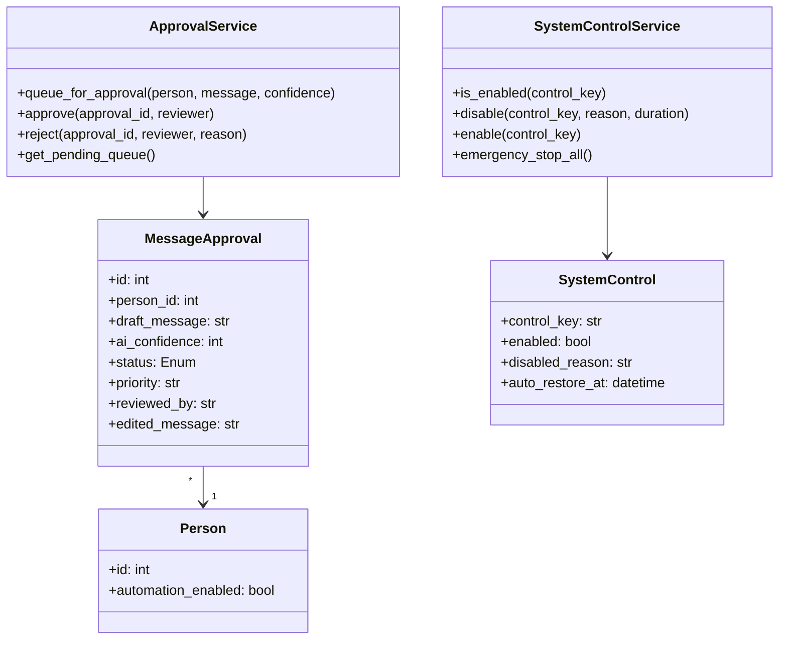
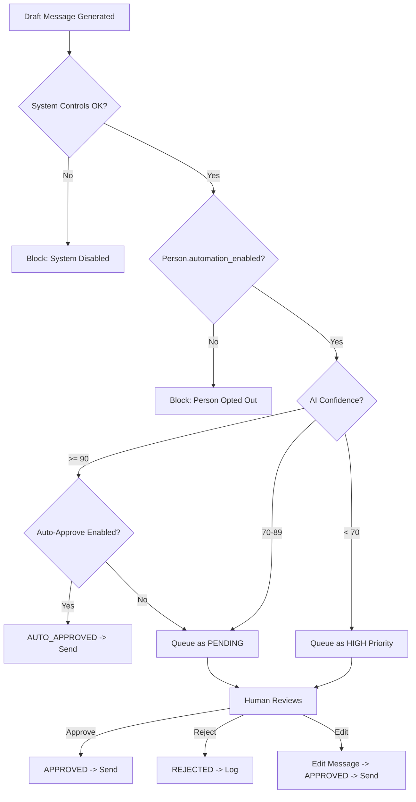

# Technical Specification: Human-in-the-Loop Safeguards

## 1. Overview

The Human-in-the-Loop (HITL) Safeguards system ensures that automated messaging never operates without appropriate oversight. It provides approval queues for draft messages, emergency stop controls, and manual override capabilities.

**Primary Goal:** Prevent harmful or inappropriate automated messages while maintaining operational efficiency through tiered approval workflows.

**Location:**
- Implemented Module: `core/approval_queue.py`
- Implemented CLI: `cli/review_queue.py` (Note: originally spec'd as `cli/review_commands.py`)
- Integration Points: `action8_messaging.py`, `action9_process_productive.py`

---

## 2. Approval Queue Schema

### 2.1 Database Models

#### MessageApproval Table

(Note: implemented as `DraftReply` model in core/database.py)

```python
class MessageApprovalStatusEnum(enum.Enum):
    """Status of a message in the approval queue."""
    PENDING = "PENDING"           # Awaiting human review
    APPROVED = "APPROVED"         # Approved for sending
    REJECTED = "REJECTED"         # Rejected, will not send
    AUTO_APPROVED = "AUTO_APPROVED"  # System auto-approved (high confidence)
    EXPIRED = "EXPIRED"           # Timed out without action

class MessageApproval(Base):
    """Queue for messages awaiting human approval before sending."""

    __tablename__ = "message_approvals"

    id: Mapped[int] = mapped_column(Integer, primary_key=True)
    person_id: Mapped[int] = mapped_column(ForeignKey("people.id"), index=True)

    # Message content
    draft_message: Mapped[str] = mapped_column(Text, nullable=False)
    template_id: Mapped[Optional[int]] = mapped_column(ForeignKey("message_templates.id"))
    message_type: Mapped[str] = mapped_column(String)  # "initial", "reply", "follow_up"

    # AI generation metadata
    ai_confidence: Mapped[int] = mapped_column(Integer)  # 0-100
    ai_reasoning: Mapped[Optional[str]] = mapped_column(Text)
    context_snapshot: Mapped[Optional[str]] = mapped_column(Text)  # JSON of context used

    # Approval workflow
    status: Mapped[MessageApprovalStatusEnum] = mapped_column(
        SQLEnum(MessageApprovalStatusEnum),
        default=MessageApprovalStatusEnum.PENDING,
        index=True
    )
    priority: Mapped[str] = mapped_column(String, default="normal")  # low, normal, high, critical

    # Review metadata
    reviewed_by: Mapped[Optional[str]] = mapped_column(String)  # Username or "SYSTEM"
    reviewed_at: Mapped[Optional[datetime]] = mapped_column(DateTime(timezone=True))
    rejection_reason: Mapped[Optional[str]] = mapped_column(Text)
    edited_message: Mapped[Optional[str]] = mapped_column(Text)  # If human modified the draft

    # Timestamps
    created_at: Mapped[datetime] = mapped_column(DateTime(timezone=True), default=func.now())
    expires_at: Mapped[Optional[datetime]] = mapped_column(DateTime(timezone=True))

    __table_args__ = (
        Index("ix_message_approval_status_priority", "status", "priority"),
        Index("ix_message_approval_person_status", "person_id", "status"),
    )
```

#### SystemControl Table

(Note: implemented via environment variables in .env: `AUTO_APPROVE_ENABLED`, `EMERGENCY_STOP`, `APP_MODE`)

```python
class SystemControlEnum(enum.Enum):
    """Types of system-wide controls."""
    MESSAGING_ENABLED = "MESSAGING_ENABLED"      # Master on/off for all messaging
    AUTO_REPLY_ENABLED = "AUTO_REPLY_ENABLED"    # Auto-replies to productive messages
    AUTO_APPROVE_ENABLED = "AUTO_APPROVE_ENABLED"  # High-confidence auto-approval
    EXPERIMENT_ENABLED = "EXPERIMENT_ENABLED"    # A/B testing active

class SystemControl(Base):
    """Global system controls and circuit breakers."""

    __tablename__ = "system_controls"

    id: Mapped[int] = mapped_column(Integer, primary_key=True)
    control_key: Mapped[str] = mapped_column(String, unique=True, index=True)
    enabled: Mapped[bool] = mapped_column(Boolean, default=True)

    # Override metadata
    disabled_reason: Mapped[Optional[str]] = mapped_column(Text)
    disabled_by: Mapped[Optional[str]] = mapped_column(String)
    disabled_at: Mapped[Optional[datetime]] = mapped_column(DateTime(timezone=True))

    # Auto-restore
    auto_restore_at: Mapped[Optional[datetime]] = mapped_column(DateTime(timezone=True))

    updated_at: Mapped[datetime] = mapped_column(DateTime(timezone=True), default=func.now(), onupdate=func.now())
```

### 2.2 Class Diagram



---

## 3. Approval Workflow

### 3.1 Tiered Approval Logic



### 3.2 Priority Assignment

| Condition | Priority | Auto-Approve Eligible |
|-----------|----------|----------------------|
| AI Confidence >= 90, no conflicts | `low` | Yes |
| AI Confidence 80-89, no conflicts | `normal` | Yes |
| AI Confidence 70-79 | `normal` | No |
| AI Confidence < 70 | `high` | No |
| First message to this person | `normal` | No |
| Person previously DESIST'd | `critical` | No |
| Contains detected PII | `high` | No |
| Critical alert triggered | `critical` | No |

---

## 4. Stop Buttons & Controls

### 4.1 Control Hierarchy

```
┌─────────────────────────────────────────────────────────────────┐
│ LEVEL 1: EMERGENCY STOP (All Automation)                        │
│ - Disables ALL automated actions immediately                    │
│ - Requires manual re-enable                                     │
│ Command: python main.py control --emergency-stop                │
└─────────────────────────────────────────────────────────────────┘
           │
           ▼
┌─────────────────────────────────────────────────────────────────┐
│ LEVEL 2: MESSAGING STOP                                         │
│ - Disables outbound messaging only                              │
│ - Other actions (gathering, inbox processing) continue          │
│ Command: python main.py control --disable messaging             │
└─────────────────────────────────────────────────────────────────┘
           │
           ▼
┌─────────────────────────────────────────────────────────────────┐
│ LEVEL 3: AUTO-APPROVE STOP                                      │
│ - Disables automatic approval                                   │
│ - All messages require manual review                            │
│ Command: python main.py control --disable auto-approve          │
└─────────────────────────────────────────────────────────────────┘
           │
           ▼
┌─────────────────────────────────────────────────────────────────┐
│ LEVEL 4: PERSON-LEVEL STOP                                      │
│ - Disables automation for specific person                       │
│ - Other matches continue normally                               │
│ Command: python main.py person --disable-automation UUID        │
└─────────────────────────────────────────────────────────────────┘
```

### 4.2 CLI Commands

```bash
# === EMERGENCY CONTROLS ===

# Stop all automation immediately
python main.py control --emergency-stop --reason "Detected issue"

# View current control status
python main.py control --status

# Re-enable after emergency
python main.py control --enable-all

# === MESSAGING CONTROLS ===

# Disable messaging for 24 hours
python main.py control --disable messaging --duration 24h --reason "Investigating 429 errors"

# Disable auto-approval permanently (until manually enabled)
python main.py control --disable auto-approve

# Enable specific control
python main.py control --enable messaging

# === PERSON-LEVEL CONTROLS ===

# Disable automation for specific person
python main.py person --uuid ABC123 --disable-automation --reason "Sensitive case"

# Re-enable for person
python main.py person --uuid ABC123 --enable-automation

# Block person permanently (DESIST)
python main.py person --uuid ABC123 --block --reason "Requested no contact"

# === APPROVAL QUEUE ===

# View pending approvals
python main.py review --pending

# Approve message
python main.py review --approve 123

# Reject with reason
python main.py review --reject 123 --reason "Tone inappropriate"

# Approve with edit
python main.py review --approve 123 --edit "Modified message content..."

# Bulk approve low-risk
python main.py review --bulk-approve --priority low --max 50
```

---

## 5. Person-Level Automation Flag

### 5.1 Database Update

Add to `Person` model in `database.py`:

```python
# In Person class
automation_enabled: Mapped[bool] = mapped_column(
    Boolean,
    default=True,
    nullable=False,
    index=True,
    comment="Whether automated messaging is enabled for this person. Set False on DESIST or manual block."
)
automation_disabled_reason: Mapped[Optional[str]] = mapped_column(
    String,
    nullable=True,
    comment="Reason automation was disabled (e.g., 'User requested DESIST', 'Manual block')."
)
automation_disabled_at: Mapped[Optional[datetime]] = mapped_column(
    DateTime(timezone=True),
    nullable=True,
    comment="Timestamp when automation was disabled."
)
```

### 5.2 Enforcement Logic

```python
def can_send_message(person: Person, session: Session) -> tuple[bool, str]:
    """
    Check if messaging is allowed for this person.
    Returns (allowed, reason).
    """
    # Check person-level flag
    if not person.automation_enabled:
        return False, f"Automation disabled: {person.automation_disabled_reason}"

    # Check person status
    if person.status == PersonStatusEnum.DESIST:
        return False, "Person status is DESIST"

    if person.status == PersonStatusEnum.BLOCKED:
        return False, "Person is blocked"

    # Check system controls
    control_service = SystemControlService(session)

    if not control_service.is_enabled("MESSAGING_ENABLED"):
        return False, "System messaging is disabled"

    return True, "OK"
```

---

## 6. Approval Queue UI

### 6.1 Queue Display

```
┌──────────────────────────────────────────────────────────────────────┐
│ APPROVAL QUEUE                                     5 Pending | 2 High│
├──────────────────────────────────────────────────────────────────────┤
│ #  │ Priority │ Person           │ Type    │ Confidence │ Age       │
├────┼──────────┼──────────────────┼─────────┼────────────┼───────────┤
│ 1  │ HIGH     │ John Smith       │ Reply   │ 65%        │ 2h ago    │
│ 2  │ HIGH     │ Mary Johnson     │ Initial │ 68%        │ 3h ago    │
│ 3  │ NORMAL   │ Robert Williams  │ Reply   │ 78%        │ 5h ago    │
│ 4  │ NORMAL   │ Sarah Davis      │ Follow  │ 82%        │ 1d ago    │
│ 5  │ LOW      │ Michael Brown    │ Initial │ 91%        │ 2d ago    │
└──────────────────────────────────────────────────────────────────────┘
Commands: [V]iew #  [A]pprove #  [R]eject #  [E]dit #  [B]ulk  [Q]uit
```

### 6.2 Detail View

```
┌──────────────────────────────────────────────────────────────────────┐
│ MESSAGE APPROVAL #1                                  Priority: HIGH  │
├──────────────────────────────────────────────────────────────────────┤
│ To: John Smith (UUID: ABC123-DEF456)                                 │
│ Relationship: 3rd Cousin | Shared DNA: 87 cM                         │
│ Type: Reply | Template: Enhanced_Productive_Reply                    │
├──────────────────────────────────────────────────────────────────────┤
│ INCOMING MESSAGE (what they said):                                   │
│ "Hi, I see we're DNA matches! My grandmother was Mary Ellen from     │
│ Ohio. Do you know anything about the Harrison family?"               │
├──────────────────────────────────────────────────────────────────────┤
│ DRAFT RESPONSE:                                                      │
│ "Dear John,                                                          │
│                                                                      │
│ Thank you for reaching out! Yes, I do have information about the     │
│ Harrison family. Mary Ellen Harrison (1890-1965) appears in my tree  │
│ as my great-great-aunt. She married Thomas Smith in 1912 in Ohio.    │
│                                                                      │
│ Do you have any photos or documents from that era?                   │
│                                                                      │
│ Best regards, Wayne"                                                 │
├──────────────────────────────────────────────────────────────────────┤
│ AI Confidence: 65%                                                   │
│ Reasoning: "Found matching person in tree. Low confidence due to     │
│ multiple Mary Ellen matches - may need verification."                │
├──────────────────────────────────────────────────────────────────────┤
│ Actions: [A]pprove  [R]eject  [E]dit  [S]kip  [B]lock Person         │
└──────────────────────────────────────────────────────────────────────┘
```

---

## 7. Integration Points

### 7.1 Action 8 Integration

```python
# In action8_messaging.py
from core.approval_queue import ApprovalService, SystemControlService

def send_message_to_person(session_manager, person: Person, message_content: str, confidence: int):
    db_session = session_manager.get_db_session()

    # Check system controls
    control_service = SystemControlService(db_session)
    if not control_service.is_enabled("MESSAGING_ENABLED"):
        logger.warning("Messaging disabled system-wide")
        return False

    # Check person-level controls
    allowed, reason = can_send_message(person, db_session)
    if not allowed:
        logger.info(f"Cannot message {person.name}: {reason}")
        return False

    # Determine if auto-approve
    approval_service = ApprovalService(db_session)

    if confidence >= 90 and control_service.is_enabled("AUTO_APPROVE_ENABLED"):
        # Auto-approve and send
        approval_id = approval_service.queue_for_approval(
            person=person,
            message=message_content,
            confidence=confidence,
            auto_approve=True
        )
        return _actually_send_message(person, message_content)
    else:
        # Queue for human review
        approval_id = approval_service.queue_for_approval(
            person=person,
            message=message_content,
            confidence=confidence,
            auto_approve=False
        )
        logger.info(f"Message queued for approval: #{approval_id}")
        return True  # Queued successfully
```

### 7.2 Scheduled Job: Process Approved Messages

```python
def process_approved_messages(session_manager):
    """
    Scheduled job to send approved messages.
    Run every 15 minutes or on-demand.
    """
    db_session = session_manager.get_db_session()
    approval_service = ApprovalService(db_session)

    approved = approval_service.get_approved_unsent()

    for approval in approved:
        person = db_session.get(Person, approval.person_id)
        message = approval.edited_message or approval.draft_message

        success = _actually_send_message(person, message)

        if success:
            approval_service.mark_sent(approval.id)
        else:
            approval_service.mark_send_failed(approval.id)
```

---

## 8. Implementation Steps

1. **Create database models**: Add `MessageApproval`, `SystemControl` to `database.py`
2. **Add Person columns**: `automation_enabled`, `automation_disabled_reason`, `automation_disabled_at`
3. **Create `core/approval_queue.py`**: Implement `ApprovalService` and `SystemControlService`
4. **Create `cli/review_commands.py`**: CLI for queue management
5. **Update `action8`**: Integrate approval workflow before sending
6. **Add scheduled job**: Process approved messages
7. **Write tests**: Approval flow, control enforcement

---

## 9. Configuration

Add to `config/config_schema.py`:

```python
@dataclass
class ApprovalSettings:
    auto_approve_threshold: int = 90  # Confidence >= 90 for auto-approve
    auto_approve_enabled: bool = True
    approval_expiry_hours: int = 72  # Expire pending approvals after 72h
    require_approval_for_first_message: bool = True
    require_approval_for_desist_history: bool = True
```
