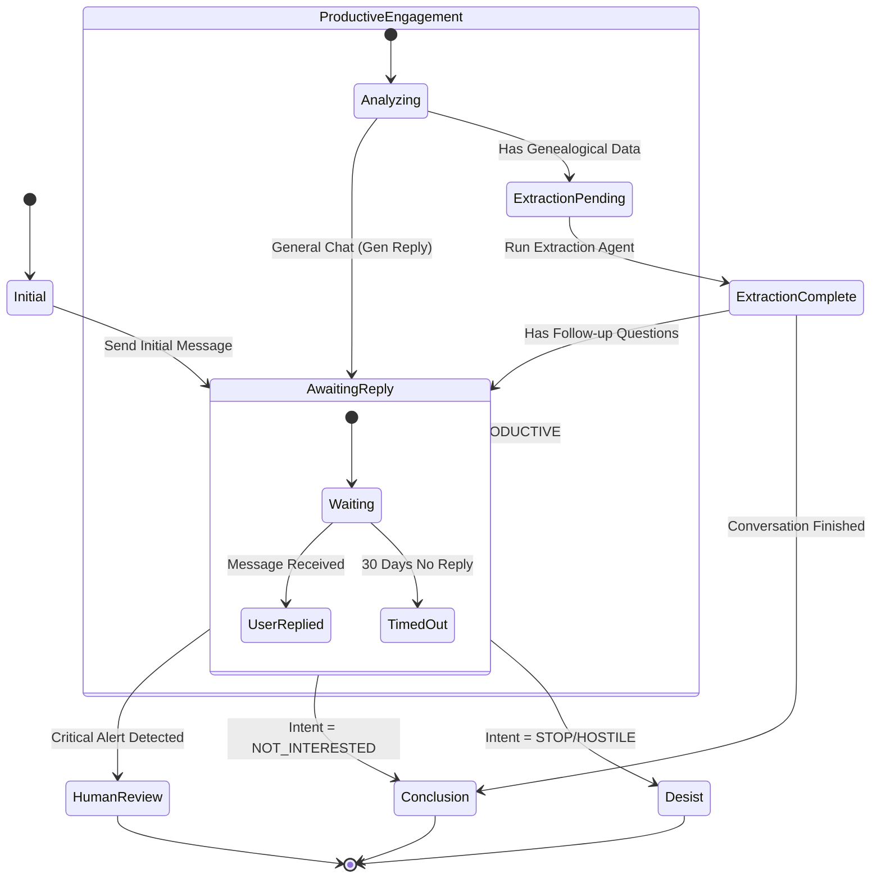

# Reply Management System Specification

## 1. Overview

The Reply Management System (RMS) is the core logic engine for Phase 2 of the Ancestry Automation Platform. It transforms the system from a simple message sender/receiver into a state-aware conversational agent. The RMS manages the lifecycle of conversations, handles state transitions based on user intent, and enforces safety protocols through critical alert detection.

## 2. Conversation State Machine

The conversation lifecycle is modeled as a finite state machine (FSM). This ensures deterministic behavior and allows for clear tracking of where each DNA match stands in the research process.

### 2.1 States

| State | Description |
| :--- | :--- |
| **Initial** | New match identified. No contact has been made yet. |
| **AwaitingReply** | We have sent a message (Initial or Follow-up) and are waiting for the user to respond. |
| **ProductiveEngagement** | User has replied positively. We are in an active dialogue to exchange information. |
| **ExtractionPending** | The latest message contains valuable genealogical data (dates, names, photos) that needs to be structured. |
| **ExtractionComplete** | Data has been extracted and tasks generated. Ready to determine next action (reply or conclude). |
| **Conclusion** | The conversation has reached a natural end point (e.g., "Thanks for sharing"). No further automation. |
| **Desist** | User has explicitly requested no further contact or expressed hostility. **Hard Stop**. |
| **HumanReview** | System detected a critical alert or ambiguous situation requiring manual intervention. |

### 2.2 Transitions & Triggers

| From State | Trigger | Condition | To State | Actions |
| :--- | :--- | :--- | :--- | :--- |
| **Initial** | Action: Send Message | Success | **AwaitingReply** | Log `INITIAL_OUTREACH` |
| **AwaitingReply** | Event: Message Received | AI Class: `PRODUCTIVE` | **ProductiveEngagement** | Notify User |
| **AwaitingReply** | Event: Message Received | AI Class: `NEGATIVE` / `STOP` | **Desist** | Update Status: `DESIST` |
| **AwaitingReply** | Event: Message Received | AI Class: `NEUTRAL` / `POLITE` | **Conclusion** | Archive Conversation |
| **AwaitingReply** | Event: Timeout (30 days) | No Reply | **Conclusion** | (Optional: Send 1 Follow-up) |
| **ProductiveEngagement** | Analysis: Data Check | Contains Entities? | **ExtractionPending** | Queue for Extraction |
| **ProductiveEngagement** | Analysis: Data Check | No Entities | **AwaitingReply** | Generate Reply |
| **ExtractionPending** | Action: Extract Data | Success | **ExtractionComplete** | Create To-Do Tasks |
| **ExtractionComplete** | Decision Logic | More questions? | **AwaitingReply** | Generate Follow-up |
| **ExtractionComplete** | Decision Logic | No more questions | **Conclusion** | Send "Thank You" |
| **Any** | Event: Critical Alert | Regex/AI Match | **HumanReview** | **STOP ALL AUTOMATION** |

### 2.3 State Diagram (Mermaid)

## 3. Critical Alert Detection

To ensure safety and compliance, a "Critical Alert" system monitors all incoming messages. This system uses a hybrid approach: **Regex** for fast, deterministic detection of high-risk keywords, and **AI** for nuanced understanding.

### 3.1 Detection Logic

If **ANY** of the following conditions are met, the conversation immediately transitions to `HumanReview` and automation is suspended for that user.

1. **Regex Match**: Message content matches a pattern in the Blocklist.
2. **AI Safety Flag**: The LLM explicitly flags the content as harmful, threatening, or legally sensitive.
3. **High-Value Discovery**: The message indicates possession of unique physical artifacts (Bibles, original photos) that require careful human handling.

### 3.2 Regex Patterns (Blocklist)

Opt-out patterns are loaded from `Data/opt_out_phrases.json`.

These patterns are case-insensitive.

#### Category: Threats & Hostility

- `(stop messaging|do not contact|cease and desist|harassment|stalking|police|lawyer|sue you|report you)`
- `(kill|murder|die|hate|scam|spammer|bot)`

#### Category: Self-Harm / Distress

- `(suicide|kill myself|end it all|want to die|no reason to live)`

#### Category: Legal / Privacy

- `(gdpr|privacy violation|data protection|attorney|legal action)`

### 3.3 Regex Patterns (High Value - Notification Only)

These do not stop automation but trigger a "High Priority" notification.

- `(family bible|original photo|daguerreotype|tin type|marriage certificate|death certificate|will|deed|diary|journal|letters)`

### 3.4 System Behavior on Alert

When a Critical Alert is triggered:

1. **State Change**: Set `ConversationStatus` to `HUMAN_REVIEW`.
2. **Lock**: Set `PersonStatus` to `BLOCKED` (temporary safety lock).
3. **Notification**:
    - Log ERROR level alert in `app.log`.
    - (Future) Send email/SMS to administrator.
4. **Response**: **DO NOT REPLY**. The system must remain silent until a human reviews the context.

## 4. Implementation Plan

### 4.1 Database Updates

- Add `conversation_state` column to `ConversationLog` or `Person` table to track the FSM state.
- Add `critical_alert_tags` (JSON) to store which patterns triggered the alert.

### 4.2 Integration Points

- **`action7_inbox.py`**:
  - Inject `SafetyGuard` before AI classification.
  - Update `process_message` to handle state transitions.
- **`action8_messaging.py`**:
  - Check `conversation_state` before sending.
  - Implement the "Reply" logic for `ExtractionComplete` -> `AwaitingReply`.
