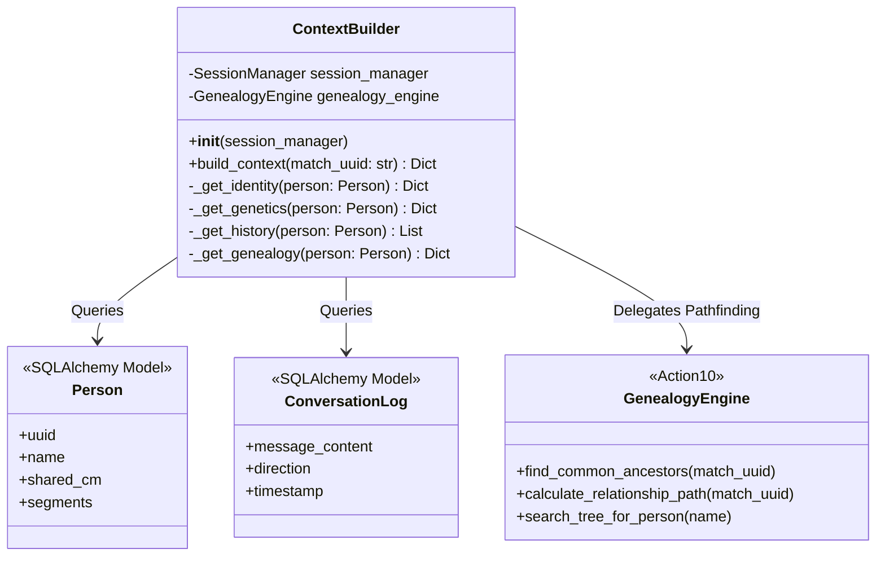
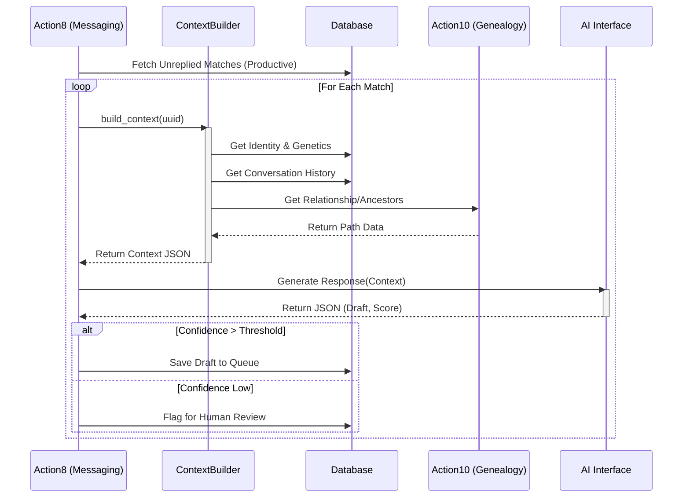

# Technical Specification: Automated Response Engine (Context-Aware Messaging)

## 1. Overview
The Automated Response Engine is a subsystem designed to generate personalized, context-aware draft messages for DNA matches. It bridges the gap between raw data (DNA, Tree, Chat History) and the AI generation layer.

**Primary Goal:** To produce a `Context` object that provides the LLM with all necessary information to write a genealogical message that sounds like a human researcher.

**Location:**
- New Module: `ai/context_builder.py`
- Integration Point: `action8_messaging.py`

---

## 2. Context Builder Service

The `ContextBuilder` class is the core aggregator. It does not generate text; it generates *knowledge*.

### 2.1 Class Design (`ai/context_builder.py`)



### 2.2 Data Aggregation Logic

The `build_context(match_uuid)` method orchestrates the following data retrieval:

1.  **Identity (Database):**
    *   **Source:** `Person` table.
    *   **Fields:** `name`, `profile_id`, `administrator_profile_id` (if managed by someone else), `note` (user notes).
    *   **Logic:** Basic ORM query by UUID.

2.  **Genetics (Database):**
    *   **Source:** `Person` table.
    *   **Fields:** `shared_cm`, `segments`, `predicted_relationship`.
    *   **Logic:** Extract numerical values to help the LLM determine closeness (e.g., "High priority, 200cM").

3.  **History (Database):**
    *   **Source:** `ConversationLog` table (joined with `Person`).
    *   **Fields:** List of previous messages (chronological), extracted entities from `action7` (if stored).
    *   **Logic:** Fetch last $N$ messages. Format as `User: ...`, `Match: ...`.

4.  **Genealogy (Action 10 Integration):**
    *   **Source:** `action10.py` (Genealogy Engine).
    *   **Fields:** `common_ancestors` (names, birth/death years), `relationship_path` (e.g., "Father -> Grandmother -> Great-Grandfather").
    *   **Logic:**
        *   If `common_ancestors` exist in the DB (cached), use them.
        *   If not, trigger `action10` logic to traverse the GEDCOM/Tree structure associated with this match.

---

## 3. Structured Retrieval (RAG Logic)

Since we are avoiding a Vector DB for this phase, we will use **Structured Retrieval** based on entity extraction.

### 3.1 Person Lookup (Name Resolution)
When a match mentions a name (e.g., "Do you know *Mary Ellen*?"), the system must look this up in the user's tree.

*   **Mechanism:** `action10` must expose a search method.
*   **Implementation:**
    ```python
    def search_tree_candidates(self, query_name: str) -> List[Dict]:
        """
        1. Normalize query_name (remove punctuation, lowercase).
        2. Query 'Person' table or in-memory GEDCOM graph.
        3. Return top 3 matches with birth/death dates for context.
        """
        pass
    ```
*   **Usage:** The `ContextBuilder` will not run this automatically *unless* the previous incoming message contains a specific question about a person (detected by `action7` intent classification).

### 3.2 Relationship Pathfinding
*   **Trigger:** Always attempted for matches > 20 cM.
*   **Logic:**
    1.  Identify "MRCA" (Most Recent Common Ancestor) candidates via surname matching or ThruLines data (if scraped).
    2.  Calculate steps: `Self -> Parent -> GP -> MRCA <- GP <- Parent <- Match`.
    3.  **Output to Context:** "We suspect our common ancestor is [Name] ([Year]-[Year]). You descend via [Child Name], I descend via [Child Name]."

---

## 4. Response Generation

### 4.1 Prompt Structure
The prompt sent to the LLM (Gemini/DeepSeek) will be structured as follows:

**System Prompt:**
> You are an expert genetic genealogist assisting a user. Your tone is helpful, polite, and professional but warm. You prioritize verifying common ancestors and sharing specific data (dates, locations). Never invent facts. If data is missing, ask for it.

**User Prompt (JSON Input):**
```json
{
  "task": "generate_reply",
  "match_details": { ... },  // From ContextBuilder
  "conversation_history": [ ... ],
  "current_intent": "provide_info_and_ask_question",
  "constraints": {
    "max_length": 150,
    "include_call_to_action": true
  }
}
```

### 4.2 Output Definition
The LLM must return a JSON object (enforced via schema or prompt instruction):

```json
{
  "draft_message": "Hi [Name], thanks for reaching out! I see we share 156cM. Based on my tree, I believe our common ancestor is...",
  "confidence_score": 85,
  "reasoning": "Found a strong link via the Smith line. Mentioned the 1910 census data available in context.",
  "missing_information": ["Need maiden name of match's grandmother"],
  "suggested_actions": ["Check 1920 Census", "Search for obituary of John Doe"]
}
```

---

## 5. Integration Flow

### 5.1 Sequence Diagram

This diagram illustrates how `action8_messaging.py` utilizes the new components.



---

## 6. Sample Context Output (JSON)

This is the payload `ContextBuilder` produces to send to the LLM.

```json
{
  "identity": {
    "name": "Sarah Jenkins",
    "uuid": "A1B2-C3D4-E5F6",
    "managed_by": "Self"
  },
  "genetics": {
    "shared_cm": 145,
    "segments": 8,
    "prediction": "3rd-4th Cousin"
  },
  "genealogy": {
    "known_common_ancestors": [
      {
        "name": "William Henry Harrison",
        "birth": "1840",
        "death": "1912",
        "location": "Ohio, USA"
      }
    ],
    "surnames_in_common": ["Harrison", "Miller"],
    "user_descent_line": ["John Gault", "Mary Harrison", "William Henry Harrison"]
  },
  "history": {
    "last_interaction_date": "2023-10-15",
    "summary": "Sarah asked about the Harrison family bible.",
    "messages": [
      {
        "role": "match",
        "content": "Hi, do you have any info on William's time in Ohio?"
      }
    ]
  },
  "extracted_facts": {
    "mentioned_locations": ["Ohio"],
    "mentioned_surnames": ["Harrison"]
  }
}
```

## 7. Implementation Steps

1.  **Create `ai/context_builder.py`**: Implement the class structure and DB queries.
2.  **Update `action10.py`**: Ensure it exposes a `get_relationship_context(uuid)` method that returns a dictionary, not just prints to console.
3.  **Update `ai_prompts.json`**: Add a new key `response_generation` with the system prompt and JSON schema.
4.  **Modify `action8_messaging.py`**:
    *   Import `ContextBuilder`.
    *   Inside the processing loop, instantiate the builder.
    *   Call the AI interface with the built context.
    *   Store the result in a new table or log file (initially) for review.
