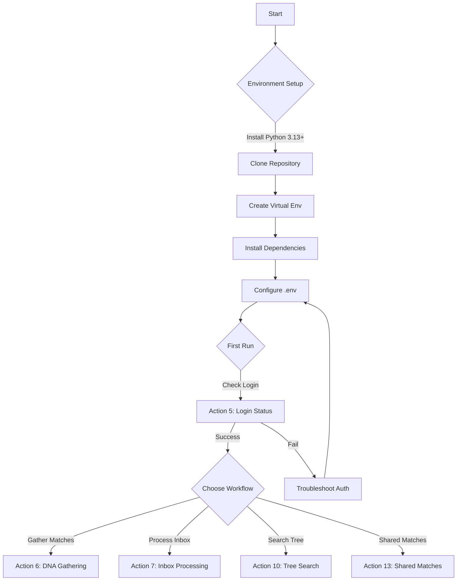
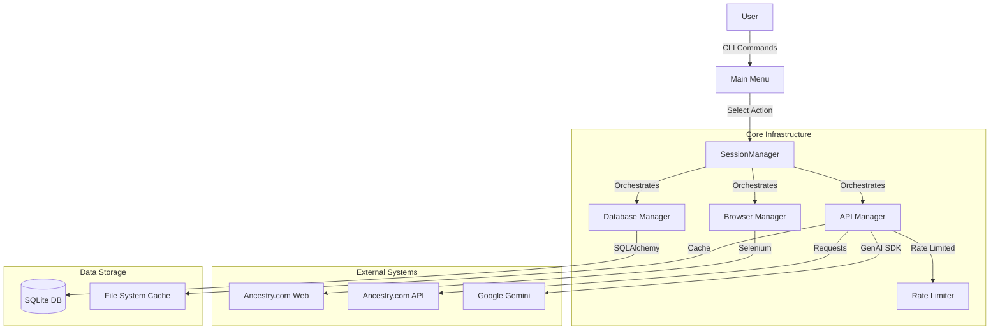
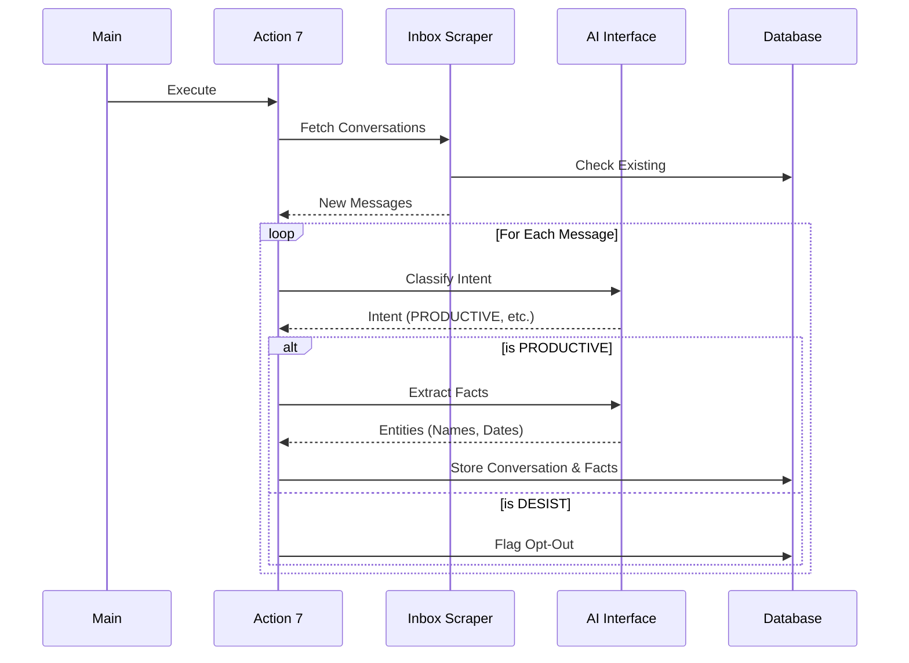

# Ancestry Genealogical Research Automation

[](https://deepwiki.com/waynegault/ancestry)

Production-grade Python automation system for Ancestry.com genealogical research, featuring intelligent DNA match collection, AI-powered conversation analysis, personalized messaging, and automated task generation.

## Action Overview

The system provides a suite of actions to automate various aspects of genealogical research. Here is a quick guide to what each action does:

### Core Workflow

- **Action 1: Run Full Workflow** - Executes the complete automation pipeline: Inbox Processing (7) → Productive Message Processing (9) → Message Sending (8). This is the standard daily operation.

### Database Management

- **Action 2: Reset Database** - Clears all data from the local database. Use with caution.
- **Action 3: Backup Database** - Creates a timestamped backup of the current database.
- **Action 4: Restore Database** - Restores the database from a previous backup.

### Browser & Data Collection

- **Action 5: Check Login Status** - Verifies current session validity and displays login details.
- **Action 6: Gather DNA Matches** - Systematically scrapes DNA matches from Ancestry.com, including ethnicity data and shared matches. Supports resuming from checkpoints.
- **Action 7: Search Inbox** - Scrapes and analyzes inbox messages, using AI to classify them (e.g., Productive, Desist, Enthusiastic).
- **Action 8: Send Messages** - Sends AI-generated, context-aware messages to DNA matches based on their status and relationship.
- **Action 9: Process Productive Messages** - Manages ongoing conversations, generating research tasks and follow-up actions for "Productive" threads.
- **Action 10: Compare: GEDCOM vs API** - Compares data from your local GEDCOM file against Ancestry's API results to identify discrepancies.
- **Action 11: Send Approved Drafts** - Sends only human-approved draft replies from the review queue (`DraftReply.status=APPROVED`). AUTO_APPROVED drafts are only included when auto-approval is enabled, and are blocked in production unless explicitly allowed.
- **Action 12: Shared Match Scraper** - Specifically fetches shared matches for high-cM matches to build cluster data.

### Advanced Research Tools

- **Action 13: DNA Match Triangulation** - Analyzes shared matches to identify common ancestors and triangulation groups.
- **Action 14: Research Tools** - A suite of interactive tools for deep analysis:
  - **Triangulation Analysis**: Analyze specific matches for triangulation.
  - **Gap Detection**: Identify missing vital records or parents in a person's profile.
  - **Sentiment Analysis**: Analyze the tone of messages.
  - **Tone Recommendation**: Get AI suggestions for message tone.
  - **Message Adaptation**: Rewrite messages in different tones (e.g., formal, friendly).
  - **Conflict Resolution**: Interactively resolve data conflicts.
  - **Ethnicity Analysis**: Filter matches by shared ethnicity regions and run triangulation analysis on them.

## Overview

This platform automates complex genealogical research workflows on Ancestry.com with enterprise-grade architecture:

- **DNA Match Collection** - Automated gathering with checkpoint resume, ethnicity comparison, relationship analysis
- **AI-Powered Analysis** - Multi-provider AI integration (Google Gemini, DeepSeek, Local LLM) with quality gates
- **Intelligent Messaging** - Context-aware automated responses with personalization
- **Task Generation** - Convert productive conversations into actionable research tasks
- **Family Tree Search** - GEDCOM parsing and API-based person search with unified scoring
- **Observability** - Prometheus metrics, Grafana dashboards, comprehensive logging with correlation IDs

### Documentation

**Project Status & Planning:**

- [Implementation Roadmap](todo.md) - Current status, remaining tasks, and next actions
- [Mission Execution Spec](docs/specs/mission_execution_spec.md) - Scope, gaps, and acceptance criteria for reply automation

**Architecture & Design:**

- [Data Flow Map](docs/specs/data_flow_map.md) - Visual and textual tracing of critical data paths
- [Tech Stack Catalog](docs/specs/tech_stack.md) - Dependencies and infrastructure stability
- [Code Graph Updater](scripts/update_code_graph.py) - Regenerates docs/code_graph.json from the current codebase

**Technical Specifications:**

- [Reply Management System](docs/specs/reply_management.md) - Conversation state machine design
- [Response Engine](docs/specs/response_engine.md) - Context builder and RAG architecture
- [Semantic Search](docs/specs/semantic_search.md) - Tree-aware Q&A with evidence-backed retrieval
- [Data Validation Pipeline](docs/specs/data_validation_pipeline.md) - Fact extraction and conflict detection
- [Human-in-the-Loop](docs/specs/human_in_the_loop.md) - Approval queue and safety controls

**Operations:**

- [Operator Manual](docs/specs/operator_manual.md) - Review queue CLI, approval workflow, emergency controls
- [Orchestrator Rollback](docs/orchestrator_rollback.md) - Rollback procedures for MessageSendOrchestrator

### Architecture Highlights

- **Enterprise Design**: SQLAlchemy ORM, Selenium WebDriver, connection pooling, circuit breakers
- **Zero-Tolerance Rate Limiting**: Thread-safe token bucket algorithm (0.3 RPS), validated across 800+ pages
- **Production Quality**: 0 linting errors (Ruff), 0 type errors (Pyright), 0 type: ignore directives, 100% test pass rate
- **Comprehensive Testing**: 191 standardized test modules, 1333 tests, 100% quality scores—all validate real behavior
- **Smart Caching**: Test runner skips unchanged modules for rapid feedback loops
- **Health Monitoring**: Integrated system health tracking with auto-recovery for stale sessions
- **CI/CD Integration**: Automated testing, linting, and quality gates via GitHub Actions
- **Automated Deployment**: One-click Grafana dashboard provisioning and updates
- **Type-Safe Configuration**: Dataclass-based config with validation, environment variable management

### Current State vs Mission

**All 8 mission requirements are now implemented** (see [mission_execution_spec.md](docs/specs/mission_execution_spec.md)):

| Requirement | Status | Implementation |
|-------------|--------|----------------|
| 1. Respect opt-out | ✅ | SafetyGuard, OptOutDetector, Person.automation_enabled |
| 2. Answer from tree | ✅ | SemanticSearchService, TreeQueryService, response_generation prompt |
| 3. Extract & validate facts | ✅ | FactValidator, Action 9, DataConflict, SuggestedFact, MS To-Do |
| 4. Research suggestions | ✅ | ContextBuilder._build_research_insights (ethnicity/cluster/triangulation) |
| 5. 100% automated | ✅ | ApprovalQueueService.is_auto_approve_ready, gradual rollout |
| 6. Performance metrics | ✅ | 4 Grafana dashboards, Prometheus metrics, EngagementTracking |
| 7. Personalized messages | ✅ | ContextBuilder, research suggestions, relationship context |
| 8. Tree incorporation | ✅ | Phase 8: TreeUpdateService for GEDCOM writes |

**Production capabilities:**
- **Action 6**: DNA match gathering with checkpoints, ethnicity, relationship analysis
- **Action 7**: Inbox ingestion with SafetyGuard, intent classification, SuggestedFact harvest
- **Action 8**: Context-aware messaging with strict outbound guards
- **Action 9**: Entity extraction with FactValidator, DataConflict staging, MS To-Do tasks
- **Action 10**: GEDCOM/API lookups with TreeQueryService
- **Action 11**: Send approved drafts from review queue
- **Action 12/13**: Shared matches and triangulation analysis

**Safety controls:**
- SafetyGuard runs before any AI work (critical alerts, opt-out detection)
- ConversationState tracks status (ACTIVE, OPT_OUT, HUMAN_REVIEW, PAUSED)
- Person.automation_enabled controls per-person messaging
- DraftReply queue with CLI review (cli/review_queue.py, cli/facts_queue.py)
- Auto-approval requires 100+ human reviews with 95%+ acceptance rate

**Observability:**
- 4 Grafana dashboards: ancestry_overview, genealogy_insights, code_quality, system_performance
- Prometheus metrics via observability/metrics_registry.py
- EngagementTracking model for conversation analytics

## Technology Stack

### Runtime Dependencies (detailed)

| Component | Technology | Version | Purpose |
|-----------|------------|---------|---------|
| **Language** | Python | 3.13+ | Core runtime |
| **ORM** | SQLAlchemy | 2.0.36+ | Database abstraction, connection pooling |
| **Browser** | Selenium | 4.27.1+ | Web automation, JavaScript execution |
| **API Client** | Requests | 2.32.3+ | HTTP client for internal APIs |
| **Parsing** | BeautifulSoup4 | 4.12.3+ | HTML parsing and extraction |
| **AI Provider** | Google GenAI | 0.8.3+ | Primary LLM interface (Gemini) |
| **Testing** | Pytest | 8.3.4+ | Test runner and fixtures |

### Infrastructure

| Component | Implementation | Key Features |
|-----------|----------------|--------------|
| **Database** | SQLite | Zero-config, file-based, relational |
| **Rate Limiter** | Token Bucket | Thread-safe, adaptive backoff (0.3 RPS) |
| **Session** | Singleton | Centralized resource management |
| **Logging** | Standard Lib | Rotating file logs, correlation IDs |
| **Config** | Pydantic/Dataclasses | Type-safe environment validation |

### Development Tools

- **Linting**: Ruff (0.8.2+) - Fast, comprehensive linting
- **Type Checking**: Pyright (1.1.389+) - Static type analysis
- **Formatting**: Black (via Ruff) - Code style enforcement
- **Version Control**: Git - Source code management

## Quick Start

### Prerequisites

- Python 3.13+
- Chrome browser
- Git
- Ancestry.com account with DNA test results

### Installation

```bash
# Clone repository
git clone https://github.com/waynegault/ancestry.git
cd ancestry

# Create virtual environment
python -m venv .venv
source .venv/bin/activate  # On Windows: .venv\Scripts\activate

# Install dependencies
pip install -r requirements.txt

# Install project in editable mode (IMPORTANT - enables local imports from any directory)
pip install -e .

# Copy environment template
cp .env.example .env
```

> **Note: Editable Install (`pip install -e .`)**
>
> This project uses Python's editable install mode. When you run `pip install -e .`, it adds
> `__editable__.ancestry-0.1.0.finder.__path_hook__` to `sys.path`, which means:
>
> - All local imports (e.g., `from core.session_manager import SessionManager`) work from any directory
> - No need for manual `sys.path.insert()` hacks in every file
> - Standalone script execution works correctly (e.g., `python actions/action6_gather.py`)
> - Changes to source files take effect immediately without reinstalling
>
> This is why you can run tests and scripts from anywhere in the project without import errors.

### Configuration

Edit `.env` with your credentials:

```env
# Required: Ancestry Authentication
ANCESTRY_USERNAME=your_email@example.com
ANCESTRY_PASSWORD=your_password

# Required: AI Provider (choose one)
AI_PROVIDER=gemini  # Options: gemini, deepseek, local_llm, moonshot, grok, inception
GEMINI_API_KEY=your_gemini_key  # If using Gemini
DEEPSEEK_API_KEY=your_deepseek_key  # If using DeepSeek

# Optional: Local LLM (LM Studio)
LOCAL_LLM_BASE_URL=http://localhost:1234/v1
LOCAL_LLM_MODEL=qwen3-4b-2507
LOCAL_LLM_API_KEY=lm-studio

# Optional: Advanced Configuration
REQUESTS_PER_SECOND=0.3  # Rate limiting (CRITICAL - do not change without validation)
MAX_PAGES=1  # Processing limit for batch operations
ENABLE_CHECKPOINTING=true  # Auto-resume capability
```

### First Run

```bash
# Run main application
python main.py

# Menu Options:
# 5 - Check Login Status (validates session)
# 6 - Gather DNA Matches (start with 1-2 pages for testing)
# 7 - Process Inbox Messages
# 10 - Search Family Tree (GEDCOM or API)
# 12 - Shared Match Scraper (Fetch shared matches for high-cM matches)
# 13 - DNA Match Triangulation (Analyze shared matches and common ancestors)
# l - Install and configure monitoring dashboards (Grafana)

### Monitoring & Observability

The platform includes built-in support for Grafana dashboards to visualize performance, genealogy insights, and code quality.

To set up monitoring:
1. Run `python main.py`
2. Type `l` at the menu prompt
3. Follow the automated installer instructions (requires Admin privileges)

This will install Grafana, configure data sources (SQLite, Prometheus), and import standard dashboards.

```

### Getting Started Flowchart



## Operator Manual

### CLI Command Reference

The system is controlled via a numbered menu in `main.py`.

| Key | Action | Description |
|-----|--------|-------------|
| **5** | Check Login | Validates session cookies and API connectivity. Run this first. |
| **6** | Gather Matches | Scrapes DNA matches. Supports `6 <page>` to start from specific page. |
| **7** | Process Inbox | Scrapes messages, runs AI classification, extracts facts. |
| **8** | Send Messages | (Draft Mode) Generates drafts for review. |
| **9** | Process Tasks | Converts productive conversations into To-Do tasks. |
| **10** | Tree Search | Search for people in GEDCOM or Ancestry API. |
| **12** | Triangulation | Analyze shared matches for common ancestors. |
| **13** | Shared Matches | Fetch shared matches for high-value targets. |
| **f** | Review Queue | Open the Human-in-the-Loop review interface. |
| **h** | Validate | Run dry-run validation on historical data. |

### Review Queue Workflow

For managing AI-generated message drafts:

1. **Access Queue**: Press `f` in the main menu.
2. **List Drafts**: `list` - Shows pending drafts with ID, Recipient, and Score.
3. **Review Draft**: `review <id>` - Shows full context (thread, draft, reasoning).
4. **Decisions**:
   - `approve` - Queues for sending.
   - `reject` - Discards draft.
   - `edit` - Opens editor to modify content.
   - `wait` - Defers for later.

### Emergency Controls

If the system behaves unexpectedly:

- **Stop Immediately**: `Ctrl+C` in the terminal. The `SessionManager` handles graceful shutdown.
- **Force Session Reset**: Delete `ancestry_cookies.pkl` and `ancestry_session.json` in root.
- **Clear Cache**: Delete `Cache/` directory to force fresh API fetches.
- **Database Rollback**: Restore from `ancestry.db.bak` (created daily).

## Architecture

### Data Flow

#### High-Level System Flow



#### Inbox Processing Flow (Action 7)



### Core Components

#### SessionManager (`core/session_manager.py`)

Central orchestrator for all browser, database, and API operations. **THE** critical component—all resource access flows through it.

**Key Methods**:

- `ensure_session_ready()` - Initializes browser, database, API clients
- `ensure_api_ready_with_browser_fallback()` - API session with automatic cookie sync
- `ensure_api_ready_browserless()` - API-only mode without browser overhead
- `refresh_browser_cookies()` - Proactive session renewal to prevent 403 errors
- `is_sess_valid()` - Session health check with age validation

**Invariant**: Exactly one SessionManager instance per execution, registered globally via `session_utils.register_session_manager()`

#### RateLimiter (`core/rate_limiter.py`)

Thread-safe token bucket algorithm prevents 429 rate limit errors.

**Configuration** (`.env`):

```env
REQUESTS_PER_SECOND=0.3      # Fill rate (CRITICAL - empirically validated)
INITIAL_DELAY=1.0            # Starting delay between requests
MAX_DELAY=15.0               # Maximum delay cap
BACKOFF_FACTOR=1.5           # Multiplier on 429 errors
DECREASE_FACTOR=0.95         # Gradual speedup on success
```

**Features**:

- Burst capacity: Initial 10 tokens for fast startup
- Adaptive backoff: 1.5x delay increase on 429 errors
- Gradual recovery: 0.95x delay decrease on success
- Thread-safe with `threading.Lock()`

**Validation**: Run `validate_rate_limiting.py` after any RPS changes—requires 50+ pages showing zero 429 errors.

#### Database Layer (`database.py`)

SQLAlchemy 2.0 ORM with soft deletes and connection pooling.

**Core Models**:

- `Person` - DNA test takers and family tree members
  - `uuid` (UPPERCASE storage) - DNA test GUID, nullable for non-testers
  - `profile_id` - User profile ID, nullable for non-member testers
  - `administrator_profile_id` - Kit manager for message routing
- `DnaMatch` - DNA matches with shared cM, ethnicity data
- `FamilyTree` - Tree assignments and ownership tracking
- `ConversationLog` - Message history with AI analysis
- `MessageTemplate` - Personalized message templates

**Critical Patterns**:

- Always use `.upper()` on UUIDs before database operations
- Call `session.expire_all()` after bulk operations to force refresh
- Use `deleted_at` for soft deletes—never hard delete

#### Error Handling (`core/error_handling.py`)

Structured exception hierarchy with automatic retry logic.

**Exception Hierarchy**:

```text
AncestryException (base)
├─ RetryableError (automatic retry applies)
│  ├─ APIRateLimitError (429 errors with retry_after)
│  ├─ NetworkTimeoutError (transient network issues)
│  └─ DatabaseConnectionError (DB connection failures)
└─ FatalError (DO NOT retry)
   ├─ DataValidationError (invalid data format)
   └─ ConfigurationError (missing/invalid config)
```

**Decorators**:

```python
@retry_on_failure(max_attempts=3, backoff_factor=2.0)
def fetch_api_data(url):
    # Automatically retries on RetryableError subclasses
    pass

@graceful_degradation(fallback_value=None)
def get_optional_data():
    # Returns fallback_value on any exception
    pass

@error_context("API Request")
def make_request():
    # Adds context to error logs automatically
    pass
```

**Circuit Breaker** (`core/circuit_breaker.py`):
Fails fast after 5 consecutive errors instead of wasting 15,000+ attempts.

```python
circuit_breaker = SessionCircuitBreaker(threshold=5)

if circuit_breaker.is_tripped():
    logger.critical("🚨 Circuit breaker TRIPPED - aborting")
    return False

if session_valid:
    circuit_breaker.record_success()  # Resets failure count
else:
    if circuit_breaker.record_failure():  # Returns True if just tripped
        logger.error("Circuit breaker tripped after 5 failures")
        abort_remaining_work()
```

### Action Modules

All actions use the `exec_actn()` wrapper pattern in `main.py`—never manage resources directly.

#### Action 6: DNA Match Gathering (`actions/action6_gather.py`)

Comprehensive DNA match collection with checkpoint resume capability.

**Features**:

- Parallel API fetching with ThreadPoolExecutor (default: 1 worker for rate safety)
- Automatic checkpoint after each page for resume capability
- Ethnicity comparison with dynamic region columns
- Relationship probability analysis
- Badge details and relationship ladders
- **Tree Data Extraction**: Captures public tree status, tree size, and tree IDs
- **Filtering**: Configurable filtering by minimum tree size and public status

**Performance** (1 worker):

- ~40-60s per page (20 matches/page)
- ~596 matches/hour throughput
- 14-20% cache hit rate on repeat runs

**Checkpoint System**:

```python
# User intent handling:
# "6" (no page) → Auto-resume from checkpoint if exists
# "6 1" (explicit page 1) → Fresh start, ignore checkpoint
# "6 50" (explicit page) → Start from page 50

# Checkpoint data (Cache/action6_checkpoint.json):
{
  "version": "1.0",
  "current_page": 449,
  "total_pages": 800,
  "counters": {"total_new": 3245, "total_updated": 4123}
}
```

**Configuration** (`.env`):

```env
ENABLE_CHECKPOINTING=true
CHECKPOINT_MAX_AGE_HOURS=24
THREAD_POOL_WORKERS=1  # CRITICAL: >1 requires rate limit validation
```

#### Action 7: Inbox Processing (`actions/action7_inbox.py`)

AI-powered message classification and conversation analysis.

**Classification Types** (using `intent_classification` prompt):

- PRODUCTIVE - Actionable genealogical information
- ENTHUSIASTIC - Excited but no specific leads
- CASUAL_CHAT - Friendly but unfocused
- DESIST - Uninterested/stop contact
- OTHER - Unclear intent

**Entity Extraction**:

- Names (people mentioned)
- Dates (years, date ranges)
- Places (locations)
- Relationships (family connections)

**Message Lifecycle**:

1. **Ingestion**: Action 7 scrapes inbox, identifying new unread messages.
2. **Classification**: AI analyzes content to determine intent (PRODUCTIVE, DESIST, etc.).
3. **Extraction**: If PRODUCTIVE, AI extracts entities (names, dates, places).
4. **Review**: High-value messages are flagged for human review (Action Review).
5. **Response Generation**: Action 8 generates a draft response based on context.
6. **Sending**: Draft is sent automatically or after approval.
7. **Task Creation**: Action 9 converts actionable details into MS To-Do tasks.

#### Action 8: Automated Messaging (`actions/action8_messaging.py`)

Context-aware personalized messaging to DNA matches.

**Template System** (`messaging/templates/`):

- Loads templates from JSON at runtime (lazy initialization)
- Variables: {match_name}, {relationship}, {shared_cm}, {tree_size}, {owner_name}
- Personalization based on match characteristics

**Message Types**:

- Initial outreach (no prior conversation)
- Follow-up messages (existing thread)
- Record sharing offers
- Research collaboration

#### Action 9: Task Generation (`actions/action9_process_productive.py`)

Converts PRODUCTIVE conversations into Microsoft To-Do tasks.

**Task Categories** (from `genealogical_task_templates.py`):

1. Vital Records (birth, death, marriage certificates)
2. Census Records (federal, state, special censuses)
3. DNA Analysis (segment comparison, triangulation)
4. Military Records (service, pension, draft)
5. Immigration Records (passenger lists, naturalization)
6. Land Records (deeds, wills, probate)
7. Church Records (baptism, confirmation, burial)
8. Newspaper Research (obituaries, announcements)

**Quality Scoring** (0-100):

- Entity richness (names, dates, places, relationships) - up to 70 points
- Task specificity (verbs, years, record types, locations) - up to 30 points
- Penalties: Missing names (-20), no verbs (-10), filler words (-10)
- Bonuses: 5+ entities (+5), specific years (+10)

**Thresholds**:

- 85-100: Excellent extraction
- 70-84: Good (production ready)
- 50-69: Acceptable (needs monitoring)
- <50: Poor (review prompt immediately)

#### Action 10: Family Tree Search (`actions/action10.py`)

Unified person search using GEDCOM files and Ancestry API with intelligent scoring.

**Search Flow**:

1. Prompt for search criteria (names, dates, places)
2. Search local GEDCOM files first (offline, fast)
3. If zero GEDCOM matches, fall back to Ancestry API
4. Score and rank results using unified scoring algorithm
5. Display top match with family members and relationship path

**Scoring System** (`research/universal_scoring.py`):

- Name matches: Exact (30 points), Contains (15 points)
- Birth year: Exact (25), ±1 year (20), ±2 years (15), ±5 years (10)
- Death year: Same scoring as birth
- Place matches: Contains comparison (15 points each for birth/death)
- Bonuses: Both names matched (+50), Both birth info (+50), Both death info (+50)
- Penalties: Alive-mode penalty if candidate has death info but search doesn't

**Configuration**:

```env
# API mode selection
API_SEARCH_BROWSERLESS=false  # Use browser-based auth for API (recommended)
```

**Display Output**:

```text
Name: Peter Fraser (1893-1953)
Birth: 1893 in Fyvie, Aberdeenshire, Scotland
Death: 1953 in Auckland

Parents:
   - James Fraser (1860-1920)
   - Margaret Gordon (1865-1945)

Spouses:
   - Margaret McKenzie (m. 1915)

Children:
   - John Fraser (1916-1998)
   - Mary Fraser (1918-2005)

Relationship to Wayne Gault:
   Wayne Gault → Margaret Mary Nicol → James Nicol → Peter Fraser
```

#### Action 12: Shared Match Scraper (`actions/action12_shared_matches.py`)

Collects shared match data for high-value DNA matches to enable triangulation.

**Features**:

- **Targeted Collection**: Fetches shared matches only for matches > 20cM (configurable)
- **Tree Data**: Captures tree size and public status for shared matches
- **Enrichment**: Updates existing match records with new shared match connections
- **Rate Limit Safe**: Uses the central rate limiter and session manager

#### Action 13: DNA Match Triangulation (`actions/action13_triangulation.py`)

Identifies triangulation opportunities by analyzing shared matches and common ancestors.

**Features**:

- **Hypothesis Generation**: Proposes relationships based on shared matches and tree data
- **Filtering**: Configurable by minimum cM (default: 20) and confidence level (HIGH, GOOD, etc.)
- **Export**: Save results to CSV or HTML for offline analysis
- **Tree Integration**: Uses extracted tree data to identify common ancestors

**Usage**:

1. Select a target DNA match (by UUID or Profile ID)
2. System analyzes shared matches
3. Identifies common ancestors in the shared matches' trees
4. Generates a hypothesis message (e.g., "We both match X, related through Y")

### AI Integration

#### Multi-Provider Architecture (`ai/ai_interface.py`)

Unified interface with automatic failover across multiple AI providers.

**Supported Providers**:

- **Google Gemini** (gemini-1.5-flash) - Primary, fast responses
- **DeepSeek** (deepseek-chat) - Cost-effective fallback
- **Local LLM** (LM Studio) - Privacy-focused offline option
- **Moonshot** (Kimi) - Additional failover
- **Grok** (xAI) - Alternative provider
- **Inception** (Mercury) - Specialized provider

**Provider Selection**:

```env
AI_PROVIDER=gemini
AI_PROVIDER_FALLBACKS=gemini,deepseek,local_llm,moonshot,grok,inception
```

**Failover Logic**:

1. Try primary provider from `AI_PROVIDER`
2. On failure, iterate through `AI_PROVIDER_FALLBACKS`
3. Skip providers without credentials/SDKs
4. Log provider switches for monitoring
5. Record telemetry for quality tracking

#### Prompt Library (`ai/ai_prompts.json`)

Versioned prompts with A/B testing support.

**Prompt Structure**:

```json
{
  "intent_classification": {
    "description": "Classify genealogy message actionability",
    "prompt": "Rules: 1) Output exactly one label: PRODUCTIVE/ENTHUSIASTIC/...",
    "variants": {
      "v2": "Updated classification logic with better context handling..."
    }
  }
}
```

**Usage**:

```python
# Use base prompt
result = call_ai('intent_classification', {'message': message_text})

# Use variant for A/B testing
result = call_ai('intent_classification', {'message': message_text}, variant='v2')
```

#### Quality Monitoring (`ai/prompt_telemetry.py`)

Comprehensive telemetry system tracks AI performance.

**Metrics Tracked**:

- `parse_success` - JSON parsing success rate
- `quality_score` - Extraction quality (0-100)
- `response_time` - Latency in milliseconds
- `provider` - Which AI provider was used
- `prompt_key` - Which prompt was invoked

**Storage**: `Logs/prompt_experiments.jsonl` (one JSON object per line)

**Commands**:

```bash
# View statistics
python prompt_telemetry.py --stats

# Generate new baseline (after prompt improvements)
python prompt_telemetry.py --baseline

# Check for quality regression
python quality_regression_gate.py
# Exit 1 if median score drops >5 points from baseline
```

**Quality Regression Gate**:
Prevents deployment if AI quality degrades—integrate into CI/CD pipeline.

```bash
# In CI/CD pipeline
python quality_regression_gate.py || exit 1
```

#### Local LLM Setup (LM Studio)

**Quick Start**:

1. Install LM Studio from <https://lmstudio.ai>
2. Download an instruct model (recommended: qwen3-4b-2507)
3. Start local server (Developer tab) → Running at `http://localhost:1234/v1`
4. Configure `.env` (see example below)
5. Enable JIT loading in LM Studio for automatic model loading
6. Test: `python test_local_llm.py`

```env
AI_PROVIDER=local_llm
LOCAL_LLM_BASE_URL=http://localhost:1234/v1
LOCAL_LLM_API_KEY=lm-studio
LOCAL_LLM_MODEL=qwen3-4b-2507
```

**Programmatic Model Loading**:

```python
import os, requests

base = os.getenv("LOCAL_LLM_BASE_URL", "http://localhost:1234/v1")
api_key = os.getenv("LOCAL_LLM_API_KEY", "lm-studio")
model = os.getenv("LOCAL_LLM_MODEL", "qwen3-4b-2507")

r = requests.post(
    f"{base}/chat/completions",
    headers={"Authorization": f"Bearer {api_key}"},
    json={
        "model": model,
        "messages": [
            {"role": "system", "content": "You are a helpful assistant."},
            {"role": "user", "content": "Say hello and report your model name."},
        ],
        "temperature": 0.2,
        "max_tokens": 64,
    },
    timeout=60,
)
print(r.status_code, r.json())
```

### Innovation Features

Advanced research intelligence modules for enhanced genealogical analysis.

#### Triangulation Intelligence (`research/triangulation_intelligence.py`)

Evidence-based hypothesis generation for DNA match relationships.

**Features**:

- **Evidence Scoring**: Weighted scoring of shared DNA, tree overlap, and common ancestors
- **Cluster Detection**: Identifies match clusters sharing common ancestors
- **Hypothesis Ranking**: Prioritizes hypotheses by evidence strength
- **Confidence Levels**: HIGH (>0.8), GOOD (0.6-0.8), MODERATE (0.4-0.6), LOW (<0.4)

**Key Classes**:

- `TriangulationIntelligence` - Main analysis engine
- `Evidence` - Individual evidence with weight and confidence
- `MatchCluster` - Group of related matches
- `TriangulationHypothesis` - Proposed relationship with supporting evidence

**Usage**:

```python
from research.triangulation_intelligence import TriangulationIntelligence

intelligence = TriangulationIntelligence()
hypothesis = intelligence.analyze_match(match_uuid, tree_data)
clusters = intelligence.find_clusters(match_list)
ranked = intelligence.prioritize_hypotheses(hypotheses)
```

#### Predictive Gap Detection (`research/predictive_gaps.py`)

Identifies research gaps and brick walls in family trees.

**Gap Types** (10 categories):

- MISSING_PARENTS, MISSING_SPOUSE, MISSING_CHILDREN
- MISSING_DATES, INCOMPLETE_LOCATION, NO_SOURCES
- GENERATION_GAP, SURNAME_DISCONTINUITY, MIGRATION_GAP, RECORD_GAP

**Features**:

- **Completeness Scoring**: 0-100 score based on data quality
- **Priority Classification**: CRITICAL, HIGH, MEDIUM, LOW
- **Brick Wall Detection**: Identifies persistent research barriers
- **Actionable Suggestions**: Specific research actions for each gap

**Key Classes**:

- `PredictiveGapDetector` - Main analysis engine
- `ResearchGap` - Individual gap with priority and suggestions
- `GapAnalysisReport` - Comprehensive analysis with completeness score
- `BrickWallCandidate` - Persistent barrier with contributing factors

**Usage**:

```python
from research.predictive_gaps import PredictiveGapDetector

detector = PredictiveGapDetector()
report = detector.analyze_person(person_data)
actions = detector.suggest_research_actions(report)
brick_walls = detector.identify_brick_walls(tree_data)
```

#### Sentiment Adaptation (`ai/sentiment_adaptation.py`)

Adapts message tone based on conversation sentiment analysis.

**Sentiment Levels**: VERY_POSITIVE, POSITIVE, NEUTRAL, NEGATIVE, VERY_NEGATIVE

**Message Tones**: WARM, FRIENDLY, PROFESSIONAL, FORMAL, CAUTIOUS

**Features**:

- **Sentiment Analysis**: Detects emotional signals in messages
- **Conversation Profiling**: Builds recipient profile from history
- **Tone Recommendation**: Suggests appropriate message tone
- **Message Adaptation**: Adjusts message style to match recipient preferences

**Key Classes**:

- `SentimentAdapter` - Main adaptation engine
- `SentimentScore` - Analysis result with positive/negative signals
- `ConversationProfile` - Recipient profile from conversation history
- `MessageRecommendation` - Tone suggestion with confidence score

**Usage**:

```python
from ai.sentiment_adaptation import SentimentAdapter

adapter = SentimentAdapter()
score = adapter.analyze_message(message_text)
profile = adapter.analyze_conversation(messages)
recommendation = adapter.recommend_tone(profile)
adapted = adapter.adapt_message(original_message, target_tone)
```

#### Conflict Detection (`research/conflict_detector.py`)

Automated detection and management of data conflicts between extracted values and stored records.

**Conflict Severities**: CRITICAL, HIGH, MEDIUM, LOW

**Conflict Statuses**: OPEN, RESOLVED, REJECTED, AUTO_RESOLVED, ESCALATED

**Features**:

- **Field-Level Comparison**: Compares extracted values against existing records
- **Similarity Scoring**: Uses SequenceMatcher for fuzzy matching (0.85 threshold)
- **Batch Detection**: Process multiple person records efficiently
- **Resolution Workflow**: Track and resolve conflicts with audit trail
- **Database Integration**: Full SQLAlchemy model with foreign keys

**Key Classes**:

- `ConflictDetector` - Main detection and management engine
- `ConflictDetectionResult` - Result of conflict analysis for a person
- `FieldComparison` - Individual field comparison with similarity score
- `DataConflict` (model) - Database record for conflict tracking

**Comparable Fields**:

| Field | Severity | Notes |
|-------|----------|-------|
| relationship | CRITICAL | Fundamental to genealogy |
| birth_year | HIGH | Key identifying data |
| death_year | HIGH | Key identifying data |
| birth_place | HIGH | Geographic identification |
| gender | HIGH | Core demographic |
| first_name | MEDIUM | May have variations |

**Usage**:

```python
from research.conflict_detector import ConflictDetector

detector = ConflictDetector(similarity_threshold=0.85)

# Compare values
comparison = detector.compare_values("birth_year", "1850", "1852")
print(f"Conflict: {comparison.is_conflict}, Similarity: {comparison.similarity_score}")

# Detect conflicts for a person
result = detector.detect_conflicts(person, extracted_data, source="conversation")
print(f"Found {result.conflicts_found} conflicts, max severity: {result.max_severity}")

# Create database records
conflicts = ConflictDetector.create_conflict_records(db_session, result)

# Resolve a conflict
ConflictDetector.resolve_conflict(
    db_session,
    conflict_id=123,
    resolution=ConflictStatusEnum.RESOLVED,
    apply_new_value=True,
    resolution_notes="Verified via census record"
)

# Get summary
summary = ConflictDetector.get_conflict_summary(db_session)
print(f"Open conflicts: {summary['total_open']}, by field: {summary['conflicts_by_field']}")
```

### Testing Infrastructure

#### Test Framework (`testing/test_framework.py`)

Standardized testing pattern used across all 188 modules.

**Standard Pattern**:

```python
def module_tests() -> bool:
    """Module-specific test implementation"""
    suite = TestSuite("Module Name", "module_file.py")

    # Add tests with descriptive names
    suite.add_test(
        lambda: isinstance(result, dict),
        "Should return dict even with None inputs"
    )

    return suite.run_tests()

# Create standard runner
run_comprehensive_tests = create_standard_test_runner(module_tests)

if __name__ == "__main__":
    success = run_comprehensive_tests()
    sys.exit(0 if success else 1)
```

**Test Quality Standards**:

1. **Explicit Assertion Messages** - All assertions include descriptive error messages:

   ```python
   # Good
   assert isinstance(result, dict), "Should return dict even with None inputs"
   assert len(names) > 0, "Should return non-empty list for valid GEDCOM data"

   # Bad
   assert isinstance(result, dict)
   ```

2. **Edge-Case Coverage**:

   - Null/None inputs: `None`, empty dicts `{}`, empty lists `[]`
   - Unicode & special characters: José María, Müller, Владимир, 李明, O'Brien
   - Malformed data: Wrong types, missing fields, invalid structures
   - Edge numbers: Zero, negative, extremely large values
   - Long inputs: 500+ character strings, 1000+ character text, 50+ records

3. **Negative-Path Testing**:

   - Invalid object types passed to functions
   - Circular references in relational data
   - Missing configuration or environment variables
   - API errors, timeouts, network failures
   - Database connection failures and rollbacks

4. **Performance Validation**:

   ```python
   def _test_large_dataset_performance() -> None:
       """Test performance with 1000 records."""
       import time

       start = time.time()
       result = process_large_batch(create_mock_records(1000))
       duration = time.time() - start

       assert duration < 5.0, f"Should complete in <5s, took {duration:.2f}s"
       assert len(result) == 1000, "Should process all records"
   ```

#### Test Utilities (`testing/test_utilities.py`)

Centralized helper functions and decorators for consistent testing.

**Test Decorators**:

```python
@with_temp_database
def test_database_operations():
    # Isolated database created for this test
    pass

@with_mock_session
def test_session_behavior():
    # Mock session provided automatically
    pass

@with_test_config({"api": {"requests_per_second": 1.0}})
def test_with_custom_config():
    # Test runs with custom configuration
    pass
```

**Fixture Factories**:

```python
# Create test match data
match = create_test_match(
    name="John Smith",
    shared_cm=150.0,
    confidence="HIGH"
)

# Create test person
person = create_test_person(
    name="Jane Doe",
    birth_year=1950,
    uuid="TEST-UUID-123"
)
```

### Safety & Engagement Components

#### Human-in-the-Loop Review Queue (`core/approval_queue.py`)

Message drafts require human approval before sending, with configurable auto-approve thresholds.

**Key Classes**:

- `ApprovalQueueService` - Manages draft lifecycle and review workflow
- `QueuedDraft` - Individual draft with metadata, scores, and priority
- `ReviewDecision` - Operator approval/rejection with reasoning

**Draft Lifecycle**:

```text
PENDING → APPROVED/REJECTED/AUTO_APPROVED/EXPIRED → SENT
```

**Auto-Approve Logic**:

```python
# Drafts auto-approve if ALL conditions met:
- quality_score >= 85 (configurable)
- opt_out_score >= 95 (safety requirement)
- No aggressive sentiment detected
- Not flagged for manual review
```

**Priority Levels**:

- `LOW` - Generic messages, can wait
- `NORMAL` - Standard priority (default)
- `HIGH` - High-value matches (>100cM)
- `CRITICAL` - Potential issues, review immediately

**CLI Commands** (see `docs/operator_manual.md`):

```bash
# View pending drafts
python main.py  # Option: Q - Review Queue

# Review specific draft
python -c "from core.approval_queue import ApprovalQueueService; svc = ApprovalQueueService(); svc.review_draft('draft-id', 'approved', 'Looks good')"
```

#### A/B Testing Framework (`ai/ab_testing.py`)

Experiment with prompt variants to optimize AI quality and engagement.

**Key Classes**:

- `ExperimentManager` - Creates and manages experiments
- `Experiment` - Single experiment with variants and metrics
- `ExperimentVariant` - Individual variant configuration
- `VariantStats` - Statistical analysis per variant

**Experiment Workflow**:

```python
from ai.ab_testing import ExperimentManager

# Create experiment
manager = ExperimentManager()
exp = manager.create_experiment(
    name="greeting_tone",
    variants=[
        {"name": "formal", "config": {"tone": "formal"}},
        {"name": "friendly", "config": {"tone": "friendly"}}
    ]
)

# Get variant assignment (consistent per user)
variant = manager.get_variant("greeting_tone", user_id="user-123")

# Record result
manager.record_result("greeting_tone", variant.name, quality_score=85)

# Get winner when sufficient data
winner = manager.get_winner("greeting_tone")  # Returns variant with best metrics
```

**Statistical Analysis**:

- Sample size tracking per variant
- Mean/median quality scores
- Response rate calculation
- Confidence intervals for winner selection

#### Opt-Out Detection (`core/opt_out_detection.py`)

Multi-layer safeguard to prevent messaging users who've requested no contact.

**Detection Layers**:

1. **Explicit Patterns** - Direct opt-out language:
   - "stop contacting me", "do not message", "unsubscribe"
   - "leave me alone", "remove from list"

2. **Implicit Patterns** - Indirect disinterest:
   - "not interested", "no thank you", "please don't"
   - "I'm too busy", "maybe later"

3. **Aggressive Patterns** - Hostile language (HIGH priority):
   - "harassment", "spam", "reported you"
   - "legal action", "blocking you"

**Analysis Result**:

```python
@dataclass
class OptOutAnalysis:
    is_opt_out: bool        # Should we stop messaging?
    confidence: float       # 0.0-1.0 confidence score
    patterns_found: list    # Which patterns triggered
    action: OptOutAction    # BLOCK, WAIT_30_DAYS, FLAG_REVIEW, PROCEED
    reasoning: str          # Human-readable explanation
```

**Actions**:

- `BLOCK` - Never message this person again
- `WAIT_30_DAYS` - Cool-off period before retry
- `FLAG_REVIEW` - Requires human review
- `PROCEED` - Safe to continue messaging

**Integration**:

```python
from core.opt_out_detection import OptOutDetector

detector = OptOutDetector()
analysis = detector.analyze(message_text)

if analysis.is_opt_out:
    logger.warning(f"Opt-out detected: {analysis.reasoning}")
    # Block or flag based on analysis.action
```

#### Dry-Run Validation (`scripts/dry_run_validation.py`)

Test message processing against historical conversations without sending.

**Features**:

- Load real conversations from database
- Generate drafts using full pipeline
- Validate opt-out detection
- Compare expected vs actual outputs
- Generate validation report

**Usage**:

```bash
# Validate against 10 historical conversations
python scripts/dry_run_validation.py --count 10

# Full validation with detailed report
python scripts/dry_run_validation.py --count 50 --verbose

# Run built-in tests
python scripts/dry_run_validation.py --test
```

**Validation Report**:

```text
Dry-Run Validation Results
==========================
Total Processed: 50
Opt-Outs Detected: 3 (correctly blocked)
High-Quality Drafts: 42 (84%)
Flagged for Review: 5
Errors: 0

Recommendation: Safe to proceed with deployment
```

#### Grafana Dashboard Deployment (`scripts/deploy_dashboards.py`)

Automate deployment of pre-configured Grafana dashboards.

**Features**:

- Deploy all dashboard JSON files from `docs/grafana/`
- Authenticate via Grafana API token
- Validate connection before deployment
- Support for incremental updates

**Usage**:

```bash
# Check connection (no deployment)
python scripts/deploy_dashboards.py --check-only --token <api_token>

# Deploy all dashboards
python scripts/deploy_dashboards.py --token <api_token>

# Use environment variable for token
export GRAFANA_API_TOKEN="your-token"
python scripts/deploy_dashboards.py

# Run built-in tests
python scripts/deploy_dashboards.py --test
```

#### Running Tests

```bash
# Run all 188 test modules (sequential)
python run_all_tests.py

# Parallel execution for speed
python run_all_tests.py --fast

# With performance log analysis
python run_all_tests.py --analyze-logs

# Fast unit tests only (<5 seconds)
python testing/run_tests_fast.py

# Single module test
python -m actions.action6_gather

# Skip live API tests (CI mode)
SKIP_LIVE_API_TESTS=true python run_all_tests.py
```

**Expected Results**:

- All 188 modules should pass with 100/100 quality scores
- 1314+ tests passing at 100% success rate
- Zero complexity warnings, zero linting errors, zero type errors

## Configuration Reference

### Environment Variables (`.env`)

#### Required: Ancestry Authentication

```env
ANCESTRY_USERNAME=your_email@example.com
ANCESTRY_PASSWORD=your_password
TREE_NAME=Gault Family  # Your main tree name
```

#### Required: AI Provider

```env
AI_PROVIDER=gemini  # Options: gemini, deepseek, local_llm, moonshot, grok, inception

# Google Gemini
GEMINI_API_KEY=your_api_key

# DeepSeek
DEEPSEEK_API_KEY=your_api_key

# Local LLM (LM Studio)
LOCAL_LLM_BASE_URL=http://localhost:1234/v1
LOCAL_LLM_MODEL=qwen3-4b-2507
LOCAL_LLM_API_KEY=lm-studio

# Provider Failover (optional)
AI_PROVIDER_FALLBACKS=gemini,deepseek,local_llm,moonshot,grok,inception
```

#### Optional: Rate Limiting (CRITICAL)

```env
REQUESTS_PER_SECOND=0.3  # CRITICAL - empirically validated, do not change
INITIAL_DELAY=1.0
MAX_DELAY=15.0
BACKOFF_FACTOR=1.5
DECREASE_FACTOR=0.95
```

**WARNING**: Changing `REQUESTS_PER_SECOND` without validation WILL break production. Run `validate_rate_limiting.py` with 50+ pages showing zero 429 errors before deploying.

#### Optional: Action 6 Configuration

```env
MAX_PAGES=1  # Processing limit for DNA match gathering
THREAD_POOL_WORKERS=1  # CRITICAL: >1 requires rate limit validation
ENABLE_CHECKPOINTING=true
CHECKPOINT_MAX_AGE_HOURS=24
HEALTH_CHECK_INTERVAL_PAGES=5  # Proactive session refresh
```

#### Optional: Testing & Development

```env
SKIP_LIVE_API_TESTS=false  # Set to true for CI/CD
LOG_LEVEL=INFO  # DEBUG for detailed logging
TEST_PROFILE_ID=your_test_profile_id  # For Action 0 (delete test)
```

#### Optional: Security & Privacy

```env
PII_REDACTION_ENABLED=false  # Set to true to redact PII from log files
# When enabled, redacts:
#   - Email addresses → [REDACTED_EMAIL]
#   - Profile IDs → ab*******yz (partial masking)
#   - UUIDs → 1234****-****-****-****-********9012 (partial masking)
#   - Phone numbers → [REDACTED_PHONE]
#   - Display names → [REDACTED_NAME]
```

### Configuration Schema (`config/config_schema.py`)

Type-safe configuration with dataclass validation:

```python
@dataclass
class APISettings:
    max_pages: int = 1  # Processing limit
    requests_per_second: float = 0.3  # CRITICAL rate limit
    max_concurrency: int = 1  # Sequential processing only
```

**ConfigManager** singleton pattern - use `get_config_manager()` for shared instance:

```python
from config.config_manager import get_config_manager

config_manager = get_config_manager()  # Returns singleton instance
config = config_manager.get_config()
```

## API Reference

### User Identity Endpoints

**Profile ID**:

```text
GET app-api/cdp-p13n/api/v1/users/me?attributes=ucdmid
Response: {"data": {"ucdmid": "07bdd45e-0006-0000-0000-000000000000"}}
```

**DNA Test UUID**:

```text
GET api/navheaderdata/v1/header/data/dna
Response: {"testId": "FB609BA5-5A0D-46EE-BF18-C300D8DE5AB7", "testComplete": true}
```

**Tree List**:

```text
GET api/treesui-list/trees?rights=own
Response: {"trees": [{"id": "175946702", "name": "Gault Family", ...}]}
```

**Tree Owner Info**:

```text
GET api/uhome/secure/rest/user/tree-info?tree_id={tree_id}
Response: {"id": 175946702, "owner": {"displayName": "Wayne Gault"}, ...}
```

### Genealogical Data Endpoints

**New Family View** (preferred):

```text
GET api/treeviewer/tree/newfamilyview/{tree_id}
Response: {"Persons": [...], "Family": {...}}
```

**TreesUI List** (person search):

```text
GET api/treesui-list/trees/{tree_id}/persons?name={name}&limit=100&fields=EVENTS,GENDERS,NAMES&isGetFullPersonObject=true
Response: {"results": [...]}
```

**Relationship Ladder**:

```text
GET family-tree/person/card/user/{user_id}/tree/{tree_id}/person/{person_id}/kinship/relationladderwithlabels
Response: {"kinshipPersons": [...]}
```

### DNA Endpoints (Action 6)

**Match Details**:

```text
GET discoveryui-matchesservice/api/samples/{my_uuid}/matches/{match_uuid}/details?pmparentaldata=true
```

**Ethnicity Comparison**:

```text
GET discoveryui-matchesservice/api/compare/{owner_guid}/with/{match_guid}/ethnicity
```

**Badge Details**:

```text
GET discoveryui-matchesservice/api/samples/{my_uuid}/matches/{match_uuid}/badgedetails
```

### Messaging Endpoints (Action 8)

**Send New Message**:

```text
POST app-api/express/v2/conversations/message
```

**Send to Existing Conversation**:

```text
POST app-api/express/v2/conversations/{conv_id}
```

**NOTE**: All endpoint literals are covered by regression guard tests in-module (api_utils, core/api_manager, dna_ethnicity_utils, core/session_manager). If any literal changes, tests fail to prevent accidental drift.

## Developer Guide

### Adding New Action Functions

1. Create action function with signature:

   ```python
   def new_action(session_manager: SessionManager, *_) -> bool:
       """
       New action description.

       Returns:
           bool: True if action completed successfully
       """
       logger.info("Starting new action...")
       # Implementation here
       return True
   ```

2. Add to `main.py` action handlers:

   ```python
   # In MENU_ACTIONS dict (around line 1650)
   MENU_ACTIONS = {
       # ...
       "12": {"label": "New Action", "func": new_action},
   }
   ```

3. Use `exec_actn()` wrapper (never manage resources directly):

   ```python
   # In main() function
   elif choice == "12":
       exec_actn(new_action, session_manager, "12")
   ```

4. Add tests using `TestSuite` pattern:

   ```python
   def module_tests() -> bool:
       suite = TestSuite("New Action Module", "new_action.py")

       suite.add_test(
           lambda: callable(new_action),
           "new_action should be callable"
       )

       return suite.run_tests()

   run_comprehensive_tests = create_standard_test_runner(module_tests)
   ```

5. Document in README.md under "Action Modules"

### Code Quality Standards

#### Linting (Ruff)

```bash
# Auto-fix before commit
ruff check --fix .

# Check only (no modifications)
ruff check .
```

**Enforced Rules**:

- E722 - Bare except clauses
- F821 - Undefined names
- I001 - Import sorting
- PLR0904 - Too many public methods
- PLR6301 - Method could be static

**Disable Per-File**:

```python
# ruff: noqa: E722
```

#### Type Hints (Pyright)

```bash
# Check types
pyright
```

**Configuration**: `pyrightconfig.json` configures standard checking

**Requirements**:

- Type hints required for all new functions
- Use `Optional[Type]` not `Type | None` for Python 3.9 compatibility
- Nullable types must be explicit

#### Logging Discipline

```python
logger.info("User-visible milestones")    # Action starts/completes
logger.debug("Internal state details")    # Variable values, control flow
logger.warning("Recoverable issues")      # Retry scenarios, fallbacks
logger.error("Action failures")           # Explicit errors requiring intervention
```

### Debugging Workflows

#### Rate Limiting Issues

```powershell
# Check for 429 errors (should return 0)
(Select-String -Path Logs\app.log -Pattern "429 error").Count

# Verify rate limiter initialization
Select-String -Path Logs\app.log -Pattern "Thread-safe RateLimiter" | Select-Object -Last 1

# Watch real-time API activity
Get-Content Logs\app.log -Wait | Select-String "429|rate|worker"
```

#### AI Extraction Issues

```bash
# Check telemetry statistics
python prompt_telemetry.py --stats

# Review recent AI responses (last 20)
Get-Content Logs\prompt_experiments.jsonl -Tail 20

# Test specific prompt in isolation
python -c "from ai_interface import call_ai; print(call_ai('intent_classification', {'message': 'Test message'}))"

# Regenerate baseline after prompt improvements
python prompt_telemetry.py --baseline
```

#### Database Issues

```bash
# Check connection pool status
python -c "from database import engine; print(engine.pool.status())"

# Query database directly
sqlite3 Data/ancestry.db
# .tables
# SELECT COUNT(*) FROM people;
# SELECT uuid, COUNT(*) FROM people GROUP BY uuid HAVING COUNT(*) > 1;
# .quit

# Backup before dangerous operations
python main.py  # Option 3: Backup Database
```

#### Session Issues

```bash
# Check session validity and age
python -c "from core.session_manager import SessionManager; sm = SessionManager(); print(f'Valid: {sm.is_sess_valid()}, Age: {sm.session_age_seconds()}s')"

# Force session refresh
python main.py  # Option 5: Check Login Status

# Clear browser cache and cookies
Remove-Item -Recurse -Force Cache\*
```

#### Performance Profiling

```bash
# Enable DEBUG logging for detailed timing
# main.py: setup_logging(log_level="DEBUG")

# Monitor memory usage
python -c "import psutil; p = psutil.Process(); print(f'Memory: {p.memory_info().rss / 1024 / 1024:.1f} MB')"

# Analyze log file for slow operations
Select-String -Path Logs\app.log -Pattern "Duration:|Elapsed:" | Select-Object -Last 20

# Profile specific action
python -m cProfile -o profile.stats main.py
# Then analyze: python -m pstats profile.stats
```

### Common Pitfalls & Solutions

#### UNIQUE Constraint Violations

**Root Cause**: UUID stored lowercase, lookup expects uppercase

**Solution**: Always use `.upper()` on UUIDs before DB operations

```python
person = session.query(Person).filter(Person.uuid == test_uuid.upper()).first()
```

#### SQLAlchemy Session Caching

**Symptom**: Bulk insert followed by immediate lookup returns None

**Solution**: Call `session.expire_all()` after bulk operations

```python
session.bulk_insert_mappings(Person, people)
session.commit()
session.expire_all()  # Force DB refresh
```

#### 429 Rate Limit Errors

**Symptom**: "429 Too Many Requests" with 72-second backoff

**Solution**:

1. Verify `REQUESTS_PER_SECOND=0.3` in `.env`
2. Run `validate_rate_limiting.py`
3. Never increase RPS without 50+ page validation showing zero 429s

#### Session Not Ready Errors

**Symptom**: "Cannot perform action: Session not ready"

**Solution**: Ensure action uses `exec_actn()` wrapper, which calls `ensure_session_ready()`

**Never**: Call browser/API operations directly without SessionManager initialization

#### Low AI Quality Scores

**Symptom**: Quality scores consistently <70 in telemetry logs

**Diagnosis**:

```bash
python prompt_telemetry.py --stats  # Check median scores
Get-Content Logs\prompt_experiments.jsonl -Tail 20  # Review recent extractions
```

**Solution**:

1. Review/update prompts in `ai_prompts.json`
2. Add variants for A/B testing
3. Run `python quality_regression_gate.py` before deployment

#### Session Expiry During Long Operations

**Symptom**: 403 errors appearing after 40 minutes of action execution

**Prevention**: Action 6 has proactive health monitoring (refreshes at 25-min mark)

**Manual Fix**:

```python
session_manager.refresh_browser_cookies()
sync_cookies_from_browser()
```

**Configuration**: Adjust `HEALTH_CHECK_INTERVAL_PAGES` in `.env` (default: 5)

## Observability

### Prometheus Metrics

The platform exports comprehensive metrics for monitoring:

**Endpoint**: `http://localhost:9090/metrics` (when metrics server running)

**Available Metrics**:

- `ancestry_action_duration_seconds` - Action execution time histogram
- `ancestry_action_success_total` - Successful action counter
- `ancestry_action_failure_total` - Failed action counter
- `ancestry_api_calls_total` - API call counter by endpoint
- `ancestry_api_response_time_seconds` - API response time histogram
- `ancestry_rate_limit_hits_total` - Rate limit encounters counter
- `ancestry_ai_quality_score` - AI extraction quality gauge (0-100)
- `ancestry_session_age_seconds` - Current session age

### Grafana Dashboards

Pre-built dashboards available in `observability/grafana/`:

**Action Performance Dashboard**:

- Action execution times (p50, p95, p99)
- Success/failure rates
- Actions per hour throughput

**API Health Dashboard**:

- API call rate by endpoint
- Response time distributions
- 429 rate limit occurrences
- Success/error ratio

**AI Quality Dashboard**:

- Quality score trends over time
- Parse success rate
- Provider usage distribution
- Prompt performance comparison

### Log Correlation

All log messages include correlation IDs for request tracking:

```python
from core.correlation import correlation_context

with correlation_context("DNA Match Gathering") as ctx:
    ctx.add_metadata("page", current_page)
    ctx.add_metadata("worker_id", worker_id)

    # All logs within this context include correlation ID
    logger.info(f"Processing page {current_page}")
    # [correlation_id=abc123-def456] Processing page 5
```

**Log Format**:

```text
2025-01-15 10:30:45 INFO [correlation_id=abc123-def456] [worker_1] Processing page 5
```

**Querying Logs by Correlation**:

```powershell
# Find all logs for specific request
Select-String -Path Logs\app.log -Pattern "correlation_id=abc123-def456"

# Count operations per correlation ID
Select-String -Path Logs\app.log -Pattern "correlation_id=" |
    Group-Object { ($_ -split "correlation_id=")[1].Split()[0] } |
    Sort-Object Count -Descending
```

## Troubleshooting

### Browser Issues

**Symptom**: Chrome fails to start or crashes immediately

**Solutions**:

1. Update Chrome to latest version
2. Run diagnostic: `python browser/diagnose_chrome.py`
3. Clear cache: `Remove-Item -Recurse -Force Cache\*`
4. Check ChromeDriver version matches Chrome: `python -c "from selenium import webdriver; print(webdriver.__version__)"`

### Authentication Issues

**Symptom**: 401 Unauthorized, 403 Forbidden errors, or "Essential cookies not found"

**Solutions**:

1. Verify credentials in `.env` are correct
2. Check if Ancestry changed password requirements
3. Force session refresh: Run Action 5 (Check Login Status)
4. Clear cookies and re-authenticate: Delete `Cache/ancestry_cookies.json`
5. Check for CAPTCHA: Some IPs may trigger CAPTCHA—use browser manually first
6. **Automatic Recovery**: The system will attempt to refresh the browser if essential cookies are missing. If this fails repeatedly, try solution #4.

### Database Issues (Troubleshooting)

**Symptom**: SQLAlchemy errors, locked database, or integrity errors

**Solutions**:

1. Check database file permissions: `ls -l Data/ancestry.db`
2. Verify no other processes have lock: `lsof Data/ancestry.db` (Linux/Mac)
3. Backup and recreate: Run Action 3 (Backup Database), then delete `Data/ancestry.db`
4. Check for schema migrations: `python core/schema_migrator.py --check`

### Performance Issues

**Symptom**: Slow execution, high memory usage, or timeouts

**Solutions**:

1. Enable DEBUG logging: Set `LOG_LEVEL=DEBUG` in `.env`
2. Profile execution: `python -m cProfile -o profile.stats main.py`
3. Check memory usage: `python -c "import psutil; p = psutil.Process(); print(p.memory_info())"`
4. Reduce batch sizes: Lower `MAX_PAGES` in `.env`
5. Monitor rate limiting: Watch for 429 errors in logs

### AI Provider Issues

**Symptom**: "AI Provider Error", low quality scores, or API failures

**Solutions**:

1. **Rate Limits**: Check if you've exceeded your provider's quota (especially Gemini free tier).
2. **API Keys**: Verify `GEMINI_API_KEY` or `DEEPSEEK_API_KEY` in `.env`.
3. **Model Availability**: Some models (e.g., `gemini-1.5-pro`) may be region-locked.
4. **Quality**: If scores are low (<70), check `Logs/prompt_experiments.jsonl` and consider adjusting prompts in `ai/ai_prompts.json`.
5. **Test Provider**: Run `python ai_api_test.py --provider gemini` to verify connectivity.
6. **Fallback**: Set `AI_PROVIDER_FALLBACKS` in `.env` for redundancy.

## Recent Changes (November 2025)

- ✅ **Safety & Engagement Sprint** (Dec 2025) - Human-in-the-loop review queue, A/B testing framework, opt-out detection
  - `core/approval_queue.py` - Message draft approval with configurable auto-approve thresholds
  - `ai/ab_testing.py` - Experiment variants with statistical analysis and winner selection
  - `core/opt_out_detection.py` - Multi-layer opt-out detection with explicit/implicit/aggressive patterns
  - `scripts/dry_run_validation.py` - Pre-deployment validation against historical conversations
  - `testing/test_integration_e2e.py` - End-to-end integration tests for full pipeline
  - `docs/operator_manual.md` - Comprehensive operator guide for review queue operations
- ✅ **Production Polish** (Nov 30) - Consolidated caching decorators, removed dead code, cleaned up misleading comments
- ✅ **Correlation ID System** (Nov 27) - Full request tracking with `core/correlation.py`
- ✅ **Test Utility Framework** (Nov 26) - Decorators and fixture factories in `test_utilities.py`
- ✅ **Developer Experience** (Nov 26) - `requirements-dev.txt`, `SECURITY.md`, `.editorconfig`, fast test runner
- ✅ **Test Standardization** (Nov 25) - All 188 modules use consistent `TestSuite` pattern
- ✅ **API Consolidation** (Oct 29) - Removed action11.py, unified into api_search_core.py
- ✅ **Rate Limit Hardening** (Oct 28) - Thread-safe RateLimiter with zero 429 errors
- ✅ **Quality Gates** (Oct 27) - Added quality_regression_gate.py for CI/CD integration
- ✅ **Local LLM Support** (Oct 26) - Full LM Studio integration with configuration guide

## Reserved for Future Development

The following functions and classes are fully implemented and tested but not yet integrated into the main application workflow. They are documented in the code with `RESERVED FOR FUTURE DEVELOPMENT` comments and are ready for use when the corresponding features are enabled.

### Test Infrastructure (`run_all_tests.py`)

| Function/Class | Purpose | Integration Status |
|---------------|---------|-------------------|
| `run_quality_checks()` | Standalone code quality analysis | Pending: Add CLI command or CI/CD integration |

### Health Monitoring (`performance/health_monitor.py`)

| Function/Method | Purpose | Integration Status |
|----------------|---------|-------------------|
| `begin_safety_test()` / `end_safety_test()` | Safety test mode for prefixing alerts | Ready for advanced monitoring |
| `get_error_rate_statistics()` | Detailed error rate analysis | Ready for dashboard integration |
| `should_emergency_halt()` | Emergency halt detection | Ready for graceful shutdown |
| `should_immediate_intervention()` | Immediate intervention detection | Ready for auto-recovery |
| `get_intervention_status()` | Current intervention status | Ready for status API |
| `reset_intervention_flags()` | Reset intervention state | Ready for manual recovery |
| `update_system_metrics()` | System-wide metrics update | Ready for metrics integration |
| `initialize_health_monitoring()` | Health monitoring system init | Ready for startup integration |
| `integrate_with_session_manager()` | SessionManager integration hook | Ready for session integration |
| `enable_session_state_persistence()` | Crash recovery persistence | Ready for session persistence |
| `create_recovery_checkpoint()` | Recovery checkpoint creation | Ready for checkpoint system |
| `get_session_recovery_status()` | Recovery status information | Ready for recovery API |

### Configuration Management (`config/config_manager.py`)

| Method | Purpose | Integration Status |
|--------|---------|-------------------|
| `reload_config()` | Hot-reload configuration from files | Ready for config refresh |
| `export_config()` | Export current config to file | Ready for config backup |
| `get_environment_config()` | Get environment-specific config | Ready for multi-env support |

### AI Integration (`ai/ai_interface.py`)

| Function | Purpose | Integration Status |
|----------|---------|-------------------|
| `generate_structured_reply()` | Phase 2.3 structured response generation with evidence citations | Ready for integration into InboundOrchestrator |
| `run_setup_wizard()` | Interactive configuration setup | Ready for first-run wizard |
| `get_database_config()` | Database configuration subset | Ready for modular access |
| `get_selenium_config()` | Browser configuration subset | Ready for modular access |
| `get_api_config()` | API configuration subset | Ready for modular access |
| `get_logging_config()` | Logging configuration subset | Ready for modular access |
| `get_cache_config()` | Cache configuration subset | Ready for modular access |
| `get_security_config()` | Security configuration subset | Ready for modular access |
| `get_observability_config()` | Observability configuration subset | Ready for modular access |

### Reserved Error Handling (`core/error_handling.py`)

| Function/Class | Purpose | Integration Status |
|---------------|---------|-------------------|
| `RetryConfig` | Comprehensive retry configuration | Ready for custom retry policies |
| `with_database_recovery()` | Database-specific error recovery | Ready for DB operations |
| `with_file_recovery()` | File operation error recovery | Ready for file operations |
| `with_circuit_breaker()` | Circuit breaker pattern decorator | Ready for service calls |
| `ancestry_session_recovery()` | Session-specific recovery | Ready for session errors |
| `ancestry_api_recovery()` | API-specific recovery | Ready for API errors |
| `ancestry_database_recovery()` | Database-specific recovery | Ready for DB errors |
| `get_error_handler()` | Get configured error handler | Ready for custom handlers |
| `handle_partial_success()` | Handle partial success scenarios | Ready for batch operations |
| `get_recovery_stats()` | Get recovery operation statistics | Ready for monitoring |

### Additional Reserved Functions

**Caching (`caching/cache.py`)**:

- `get_cache_coordination_stats()` - Cache coordination statistics
- `CacheDependencyTracker` class with `add_dependency()`, `invalidate_with_dependencies()`, `get_dependency_chain()`
- `get_cache_dependency_tracker()` - Get dependency tracker instance

**Feature Flags (`core/feature_flags.py`)**:

- `clear_all_overrides()` - Clear all feature flag overrides
- `get_flag()` - Get individual feature flag value
- `list_flags()` - List all feature flags
- `load_from_file()` - Load flags from configuration file

**Type Definitions (`core/type_definitions.py`)**:

- `PersonInfo`, `DNAMatchInfo`, `SearchResult`, `ConversationMessage`, `TaskInfo` - Type definitions for structured data
- `Loggable`, `Scoreable` - Protocols for common interfaces

**Rate Limiting (`core/rate_limiter.py`)**:

- `get_endpoint_summary()` - Get per-endpoint rate statistics
- `log_throttle_warning()` - Log throttle warnings
- `get_rate_limiter_state_source()` - Get rate limiter state source

### Discovering Reserved Functions

To find all reserved functions in the codebase:

```bash
# Scan for dead code candidates
python testing/dead_code_scan.py --verbose

# Results written to: Cache/dead_code_candidates.json
```

The dead code scanner identifies functions that are defined but have only their own definition as a reference. These are either:

1. **Public API methods** - Designed for external use (not dead code)
2. **Reserved functions** - Implemented but pending integration (documented above)
3. **Protocol/TypedDict classes** - Type definitions (not callable code)

All reserved functions are fully tested and maintain 100% code quality scores.

## Dependencies

### Core Dependencies

- **selenium 4.31.0+** - Browser automation (ChromeDriver auto-updates via webdriver-manager)
- **SQLAlchemy 2.0.40+** - Database ORM with soft deletes, connection pooling
- **requests 2.32.3+** - HTTP client for API calls (shares rate limiter with Selenium)
- **beautifulsoup4 4.13.3+** - HTML parsing for inbox scraping
- **tqdm 4.67.1+** - Progress bars with ETA calculation

### AI Providers

- **google-generativeai 0.8.4** - Google Gemini AI provider
- **openai 1.0.0+** - OpenAI-compatible client (Local LLM, Grok fallback)
- **requests** - HTTP client for DeepSeek, Moonshot, Inception

### Development Dependencies (requirements-dev.txt)

- **ruff** - Fast Python linter
- **pyright** - Static type checker
- **pytest** - Testing framework (optional, using built-in TestSuite)
- **pytest-cov** - Coverage reporting

## Project Structure

```text
├── actions/              # Action modules (6-11)
│   ├── action6_gather.py
│   ├── action7_inbox.py
│   ├── action8_messaging.py
│   ├── action9_process_productive.py
│   ├── action10.py
│   └── gather/          # Action 6 sub-modules
│       ├── checkpoint.py
│       ├── fetch.py
│       ├── metrics.py
│       ├── orchestrator.py
│       └── persistence.py
├── ai/                  # AI integration
│   ├── ai_interface.py
│   ├── ai_prompts.json
│   ├── prompt_telemetry.py
│   ├── quality_regression_gate.py
│   ├── ab_testing.py           # A/B testing framework
│   └── providers/       # Provider adapters
│       ├── base.py
│       ├── gemini.py
│       ├── deepseek.py
│       └── local_llm.py
├── api/                 # API utilities
│   ├── api_constants.py
│   ├── api_search_core.py
│   ├── api_search_utils.py
│   └── api_utils.py
├── browser/             # Browser automation
│   ├── chromedriver.py
│   ├── css_selectors.py
│   ├── selenium_utils.py
│   └── diagnose_chrome.py
├── caching/             # Cache management
│   ├── cache.py
│   ├── cache_manager.py
│   └── cache_retention.py
├── config/              # Configuration
│   ├── config_schema.py
│   ├── config_manager.py
│   └── validator.py
├── core/                # Core infrastructure
│   ├── session_manager.py      # Central orchestrator
│   ├── browser_manager.py
│   ├── api_manager.py
│   ├── database_manager.py
│   ├── error_handling.py       # Exception hierarchy
│   ├── rate_limiter.py         # Token bucket algorithm
│   ├── circuit_breaker.py
│   ├── correlation.py          # Request tracking
│   ├── logging_config.py
│   ├── metrics_collector.py
│   ├── approval_queue.py       # Human-in-the-loop review
│   └── opt_out_detection.py    # Multi-layer opt-out safeguards
├── genealogy/           # Genealogical utilities
│   ├── gedcom_search_utils.py
│   ├── gedcom_utils.py
│   ├── relationship_utils.py
│   └── universal_scoring.py
├── messaging/           # Messaging system
│   ├── message_personalization.py
│   ├── person_eligibility.py    # Person eligibility checks
│   ├── template_selector.py     # Template selection logic
│   ├── send_orchestrator.py     # Unified message send pipeline
│   ├── shadow_mode_analyzer.py  # Shadow mode decision comparison
│   ├── send_metrics.py          # Prometheus metrics for send operations
│   ├── send_audit.py            # Audit trail for send decisions
│   └── templates/       # Message templates
├── observability/       # Monitoring
│   ├── prometheus_exporter.py
│   └── grafana/         # Dashboard configs
├── research/            # Research utilities
│   ├── dna_ethnicity_utils.py
│   ├── genealogical_task_templates.py
│   └── universal_scoring.py
├── testing/             # Test infrastructure
│   ├── test_framework.py
│   ├── test_utilities.py
│   ├── run_tests_fast.py
│   ├── code_quality_checker.py
│   └── test_integration_e2e.py  # End-to-end tests
├── scripts/             # Operational scripts
│   └── dry_run_validation.py    # Pre-deployment validation
├── docs/                # Documentation
│   └── operator_manual.md       # Review queue operations
├── Cache/               # Runtime cache
├── Data/                # Database storage
│   └── ancestry.db
├── Logs/                # Application logs
│   ├── app.log
│   ├── prompt_experiments.jsonl
│   └── analytics.jsonl
├── main.py              # Entry point
├── database.py          # SQLAlchemy models
├── utils.py             # Utility functions
├── requirements.txt     # Production dependencies
├── requirements-dev.txt # Development dependencies
├── run_all_tests.py     # Test orchestrator
├── .env                 # Configuration (not in repo)
├── .env.example         # Configuration template
└── README.md            # This file
```

## Contributing

### Development Workflow

1. **Fork and Clone**:

   ```bash
   git clone https://github.com/yourusername/ancestry.git
   cd ancestry
   ```

2. **Create Virtual Environment**:

   ```bash
   python -m venv venv
   source venv/bin/activate  # Windows: venv\Scripts\activate
   pip install -r requirements.txt
   pip install -r requirements-dev.txt
   ```

3. **Create Feature Branch**:

   ```bash
   git checkout -b feature/your-feature-name
   ```

4. **Make Changes**:

   - Follow code quality standards (Ruff, Pyright)
   - Add tests using `TestSuite` pattern
   - Update documentation as needed

5. **Run Tests**:

   ```bash
   # Full test suite
   python run_all_tests.py

   # Fast unit tests
   python testing/run_tests_fast.py

   # Specific module
   python -m your_module
   ```

6. **Check Code Quality**:

   ```bash
   # Linting
   ruff check --fix .

   # Type checking
   pyright

   # Test quality
   python testing/code_quality_checker.py
   ```

7. **Commit and Push**:

   ```bash
   git add .
   git commit -m "feat: Add your feature description"
   git push origin feature/your-feature-name
   ```

8. **Create Pull Request**:

   - Ensure all tests pass
   - Include clear description of changes
   - Reference any related issues

### Code Review Checklist

- [ ] All tests pass (`python run_all_tests.py`)
- [ ] Zero linting errors (`ruff check .`)
- [ ] Zero type errors (`pyright`)
- [ ] Test coverage for new code (use `TestSuite` pattern)
- [ ] Documentation updated (README.md, docstrings)
- [ ] No hardcoded credentials (use `.env`)
- [ ] Explicit assertion messages in tests
- [ ] Edge cases covered (None, empty, Unicode, malformed data)
- [ ] Performance validated for large datasets

## License

This project is licensed under the MIT License - see the [LICENSE](LICENSE) file for details.

## Support

- **Issues**: [GitHub Issues](https://github.com/waynegault/ancestry/issues)
- **Documentation**: [DeepWiki](https://deepwiki.com/waynegault/ancestry)
- **Security**: See [SECURITY.md](SECURITY.md) for vulnerability reporting

## Acknowledgments

- Ancestry.com for providing the platform and APIs
- Google Gemini and DeepSeek for AI capabilities
- LM Studio for local LLM support
- Selenium and SQLAlchemy communities for excellent tools

---

**Note**: This is a research automation tool for personal genealogical research. Always respect Ancestry.com's Terms of Service and rate limiting policies. The default rate limit (0.3 RPS) is empirically validated to be safe—do not increase without proper validation.
